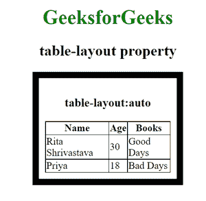
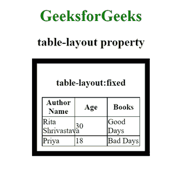

# CSS 中“表格布局”属性有哪些用法？

> 原文:[https://www . geesforgeks . org/什么是 css 中的表格布局属性用法/](https://www.geeksforgeeks.org/what-are-the-usage-of-table-layout-property-in-css/)

CSS 中的 [**表格布局**](https://www.geeksforgeeks.org/css-table-layout-property/) 属性指定表格的布局，表格由表格单元格、行和列组成。

**语法:**

```
table-layout: auto | fixed | initial | inherit;
```

**属性值:**这些是表格布局的属性及其用法。

*   **自动:**属性值*自动*用于在浏览器上创建自动表格布局。此属性通过表格单元格中不可破解的内容创建列宽。
*   **固定:**属性值*固定*用于创建固定的表格布局。表格和列的宽度由表格和列的宽度或第一行单元格的宽度创建。
*   **初始值:**属性值用于创建其默认值。
*   **继承:**从其父级继承属性的属性值。

**示例 1:** 在本例中，*表格布局:*使用*自动*属性，在该属性中，在浏览器上创建自动表格布局，该属性通过表格单元格中不可破解的内容创建列宽。

## 超文本标记语言

```
<!DOCTYPE html>
<html>
    <head>
        <title>table-layout property</title>
        <style>
            table {
            border-collapse: collapse;
            border: 1px solid black;
            }
            th, td {
            border: 1px solid black;
            }
            table#table1 {
            table-layout: auto;
            width: 200px;
            }
            div {
                max-width:200px;
                padding:10px;
                border:10px solid black;
            }
            h1 {
                color:green;
            }
        </style>
    </head>
    <body>
        <center>
        <h1>GeeksforGeeks</h1>
        <h2>table-layout property</h2>
        <div>
        <h3>table-layout:auto</h3>
        <table id = "table1">
            <tr>
                <th>Name</th>
                <th>Age</th>
                <th>Books</th>
            </tr>
            <tr>
                <td>Rita Shrivastava</td>
                <td>30</td>
                <td>Good Days</td>
            </tr>
            <tr>
                <td>Priya </td>
                <td>18</td>
                <td>Bad Days</td>
            </tr>
        </table>
        </div>
        <br>
        </center>
    </body>
</html>
```

**输出:**



**示例 2:** 在此示例中，*表格布局:*使用了*固定*属性，其中创建了固定的表格布局，表格和列宽度由表格和列的宽度或第一行单元格的宽度创建。

## 超文本标记语言

```
<!DOCTYPE html>
<html>
    <head>
        <title>table-layout property</title>
        <style>
            table {
            border-collapse: collapse;
            border: 1px solid black;
            }
            th, td {
            border: 1px solid black;
            }
            table#table1 {
            table-layout: fixed;
            width: 200px;
            }
            div {
                max-width:200px;
                padding:10px;
                border:10px solid black;
            }
            h1 {
                color:green;
            }
        </style>
    </head>
    <body>
        <center>
        <h1>GeeksforGeeks</h1>
        <h2>table-layout property</h2>
        <div>
        <h3>table-layout:fixed</h3>
        <table id = "table1">
            <tr>
                <th>Author Name</th>
                <th>Age</th>
                <th>Books</th>
            </tr>
            <tr>
                <td>Rita Shrivastava</td>
                <td>30</td>
                <td>Good Days</td>
            </tr>
            <tr>
                <td>Priya</td>
                <td>18</td>
                <td>Bad Days</td>
            </tr>
        </table>
        </div>
        </center>
    </body>
</html>
```

**输出:**



表格布局