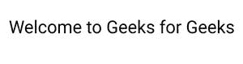
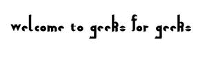

# CSS 中的网页安全字体和回退字体是什么？

> 原文:[https://www . geeksforgeeks . org/什么是网络安全字体和回退字体 css/](https://www.geeksforgeeks.org/what-are-web-safe-fonts-and-fallback-fonts-in-css/)

**网络安全字体:**网络安全字体是那些通常安装在所有浏览器和操作系统中的字体。可以用作网络安全字体的字体示例如下。

*   威登达
*   格鲁吉亚
*   天线
*   衬线
*   无衬线字体
*   新罗马时代
*   坎达拉
*   卡里布里布里布里布里布里布里布里布里布里布里布里布里布里布里布里布里布里布里布里布里布里布里布里布
*   ＯＰＴIＭＵＭ的复数
*   露西达·布莱特

**后退字体:**没有字体是 100%网页安全字体。您视为网页安全字体的字体可能没有正确安装。在这种情况下，我们使用一些字体进行备份，这些字体被称为回退字体。

通常用作备用字体的字体示例如下。

*   草书
*   幻想
*   单一间隔
*   qadiri

**注意:**所有用作网页安全字体的字体也可以用作后备字体。

**语法:**

```
Selector {
  font-family: font-1, font-2, font-3;
}
```

*   font-1 将是我们的网络安全字体。
*   font-2 和 font-3 将是我们的后备字体。

您可以添加任意多的备用字体。

**解释:**将显示 font-1，但是由于任何原因，font-1 在任何浏览器或操作系统上都不可用，那么在这种情况下将使用 font-2。如果字体-2 也不可用，那么将使用字体 3，以此类推。

**示例 1:** 以下代码显示了“p”元素的网页安全字体。

## 超文本标记语言

```
<!DOCTYPE html>
<html>
    <head>

        <!-- Google Fonts -->
        <!--We used Google font. You can also download
            any font and then use it --->
          <link rel="preconnect"
                href="https://fonts.googleapis.com">
          <link rel="preconnect" 
                href="https://fonts.gstatic.com" crossorigin>
          <link href=
"https://fonts.googleapis.com/css2?family=Roboto&display=swap" 
                rel="stylesheet">        
        <style>            
           p{
             font-family: Roboto, sans-serif;
            }
            /* When the font name is more than one word, 
               it must be in quotation marks like: "Lucida Console" */
        </style>
    </head>
    <body>
        <p>Welcome to Geeks for Geeks</p>
    </body>
</html>
```

**输出:**



**示例 2:** 当网络安全字体不可用时，将使用回退字体。

## 超文本标记语言

```
<!DOCTYPE html>
<html>
    <head>
        <!-- Google Fonts -->
        <!-- You can also download any font and then use it  -->
        <link rel="preconnect" 
              href="https://fonts.googleapis.com">
        <link rel="preconnect" 
              href="https://fonts.gstatic.com" crossorigin>
        <link href=
"https://fonts.googleapis.com/css2?family=Qahiri&display=swap" 
              rel="stylesheet">
        <title>Web Safe font and fallback font</title>
        <style>

           p{
            font-family: sans-serif,'Qahiri'; 
            }
            /* Qahiri will be implemented when web safe font 
              i.e sans-serif is not available */
            /* When the font name is more than one word, 
               it must be in quotation marks, like: "Lucida Console" */
        </style>
    </head>

    <body>
        <p>Welcome to Geeks for Geeks</p> 
    </body>
</html>  
```

**输出:**

