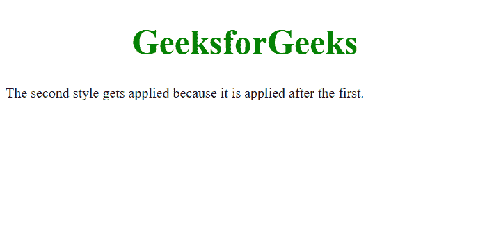

# CSS 的层叠部分是什么意思？

> 原文:[https://www . geeksforgeeks . org/CSS 的级联部分意味着什么/](https://www.geeksforgeeks.org/what-does-the-cascading-portion-of-css-means/)

CSS 通过分离网页文档的样式信息，包括字体大小、字体颜色、线宽和背景颜色，简化了维护网页文档的任务。这种分离允许您将相同的样式规则应用于多个网页。CSS 允许您在单个网页上多次应用一种样式。CSS 文件中的样式是根据 CSS 推荐的规则定义的，该规则建议网页应该如何呈现。CSS 文件包含结构的样式代码，包括标题、列表、段落和链接。

现在在 CSS 中谈论层叠意味着样式规则。这是 CSS 变得不必要复杂的部分，即使使用层叠的能力偶尔有用。

所以，让我们从一个问题开始，“如果你有两个属性冲突的 CSS 类怎么办？”哪一个“胜出”并被应用？让我们看看下面的例子。

**示例:**

## 超文本标记语言

```css
<!DOCTYPE html>
<html lang="en">

<head>
    <style>
        h1 {
            font-size: 40px;
            text-align: center;
            color: red;
        }

        h1 {
            color: green;
        }
    </style>
</head>

<body>
    <h1>GeeksforGeeks</h1>

<p>The second style gets applied because
    it is applied after the first.</p>

</body>

</html>
```

**输出:**



我们有两个具有相同 *h1* 标签的颜色属性。哪一个被申请了？这就是 C 在 CSS 中的作用，因为他们是平等的，最后一个获胜。所以在这种情况下，h1 是绿色的。所以请记住这条规则:**当一切都平等时，最后一条规则适用。**

CSS 中的 C 代表什么？级联。所以层叠意味着，如果我们在文档的前面列出一种样式，我们说这是一种方式，然后在文档的后面，我们可以说这是一种不同的方式，文档后面的东西获胜。优先级较高的样式将覆盖优先级较低的规则。