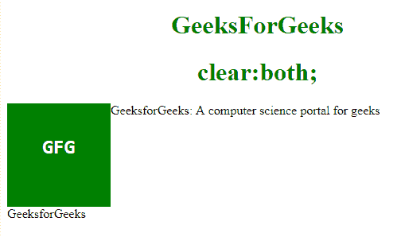

# CSS 规则“clear: both”是做什么的？

> 原文:[https://www . geesforgeks . org/what-the-CSS-rule-clear-both-do/](https://www.geeksforgeeks.org/what-does-the-css-rule-clear-both-do/)

**清除属性**用于指定浮动元素的哪一侧不允许浮动。它设置或返回元素相对于浮动对象的位置。

**“清除:两者”**表示浮动，不允许元素在两侧浮动。当不需要任何元素浮动在与指定元素相关的左侧和右侧，并且只需要下面显示的下一个元素时，使用它。它还表示没有其他元素占用左侧和右侧的空间。

**语法:**

```
clear:both; 
```

**示例:**

```
<!DOCTYPE html> 
<html> 
    <head> 
        <style> 
            div { 
                width:100px; 
                height:100px; 
                background-color:green; 
                color:white; 
                font-weight:bold; 
                font-size:25px; 
                text-align:center; 
                float: left; 
                padding:15px; 
            } 
            p.GFG { 
                clear: both; 
            } 
            h1 { 
                color:green; 
                text-align:center; 
            } 
        </style> 
    </head> 
    <body> 
        <h1>GeeksForGeeks</h1> 
        <h1>clear:both;</h1> 
        <div><pre>GFG</pre></div> 
        <p>GeeksforGeeks: A computer science portal for geeks</p> 
        <p class="GFG">GeeksforGeeks</P> 
    </body> 
</html>                     
```

**输出:**


**支持的浏览器:**支持的浏览器如下:

*   谷歌 Chrome
*   微软公司出品的 web 浏览器
*   火狐浏览器
*   歌剧
*   旅行队