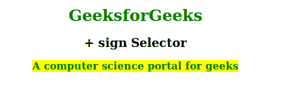

# CSS 选择器“+”(加号)是什么意思？

> 原文:[https://www . geesforgeks . org/加号-css-selector-mean/](https://www.geeksforgeeks.org/what-does-the-plus-sign-css-selector-mean/)

“+”符号选择器用于选择紧接在指定元素之后但不在特定元素内部的元素。

**注意:**IE8 及更早版本< /DOCTYPE >必须声明为工作元素+元素选择器。

**语法:**

```css
element + element {
    // CSS property
} 

```

**示例:**

```css
<!DOCTYPE html>
<html>
    <head>
        <title>+ sign selector</title>
        <style>
            h2 + div {
                font-size:20px;
                font-weight:bold;
                display:inline;
                background-color: yellow;
                color:green;
            }
            h1 {
            color:green;
            }
            body {
                text-align:center;
            }
        </style>
    </head>
    <body>
        <h1>GeeksforGeeks</h1>
        <h2>+ sign Selector</h2>
        <div>A computer science portal for geeks</div>
    </body>
</html>                    
```

**输出:**


**支持的浏览器:**下面列出了“+”选择器支持的浏览器:

*   苹果 Safari
*   谷歌 Chrome
*   火狐浏览器
*   歌剧
*   Internet Explorer 7.0