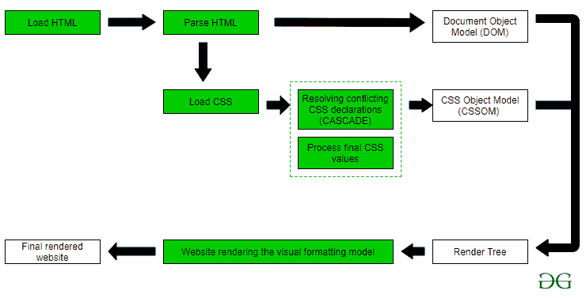

# 当我们加载一个页面时，CSS 会发生什么？

> 原文:[https://www . geesforgeks . org/当我们加载页面时 css 会发生什么/](https://www.geeksforgeeks.org/what-happens-to-css-when-we-load-a-page/)

虽然我们知道如何编写 HTML 和 CSS 的代码，但许多开发人员不知道浏览器将如何处理 HTML 和 CSS。如果你不知道如何处理 HTML 和 CSS，那么不要担心，我在这里帮助你。本文将帮助有抱负的开发人员和从事网络基础工作的开发人员巩固他们头脑中的信息概念。阅读全文，掌握知识。

**什么是 HTML 和 CSS？**

html 表示超文本标记语言，CSS 表示级联样式表。简单来说，HTML 是用来给出整个网页的结构的，顺便说一下，网页的结构意味着你现在在页面中看到的文字写的，还有图片，CSS 包含的样式意味着 HTML 元素在页面上应该是什么样子。

**当 Css(级联样式表)在浏览器中加载时会发生什么**[/标题]

什么是解析？：

解析只不过是将开发人员编写的代码处理成可视化格式。解析 **html** 和 **Css** 意味着浏览器将如何处理它们，以及它将如何在浏览器屏幕上以视觉格式排列我们的代码。

现在我们通过浏览器学习 html 和 css 的<u>处理和解析阶段</u>。

*   当用户请求网站时，浏览器将从服务器请求 HTML 文档，浏览器将在 HTML 文档中加载代码。

*   在第二步中，浏览器将在处理代码的同时处理代码，它将下载图片和其他 CSS 文件来设计网页的样式，CSS 代码也将加载到浏览器中。当解析 HTML 文件时，会下载 CSS 文件。

    DOM( **文档对象模型**)将由浏览器创建。DOM 意味着对 HTML 文件中所有元素的引用。

*   CSS 的解析将分两步进行。

    **那两步是:**

    *   在这一步中，浏览器将从上到下扫描 css 文件，这里的**解决冲突**来自于 Css 层叠规则，这里浏览器将为 html 元素制作最终属性的虚拟列表。

    *   在这一步中，浏览器将为应该应用于 HTML 元素的属性分配最终的计算值。这里**最终计算值**将基于视口(指屏幕上浏览器的大小)进行计算。这里的最终值所有的相对值都将转换为绝对值。

*   求解后 CSS 解析阶段的两个主要工作。之后浏览器会创建 **CSSOM** 。CSSOM 意味着级联样式表，对象模型。简而言之，CSSOM 意味着最终应该在用户面前的浏览器中为 HTML 元素应用的样式。

    *   在这一步中，浏览器将获取 DOM 和 CSSOM，并创建最终的渲染树。渲染树将有所有的 HTML 元素和样式。浏览器会将该**渲染树**交给可视化格式化工具。

    视觉格式化工具将创建页面的最终布局，这将创建我们的 HTML 和 CSS 代码的最终视觉版本。

    *   网站被渲染。我们将看到我们在代码编辑器上编写的代码的最终渲染网站视觉效果。