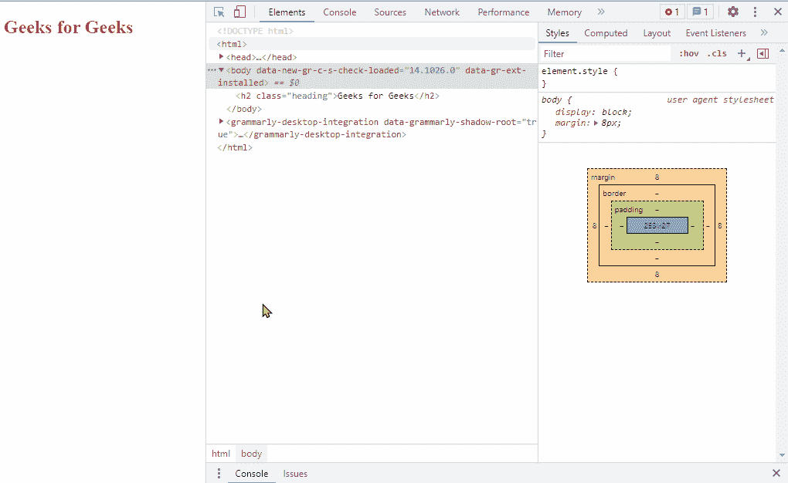
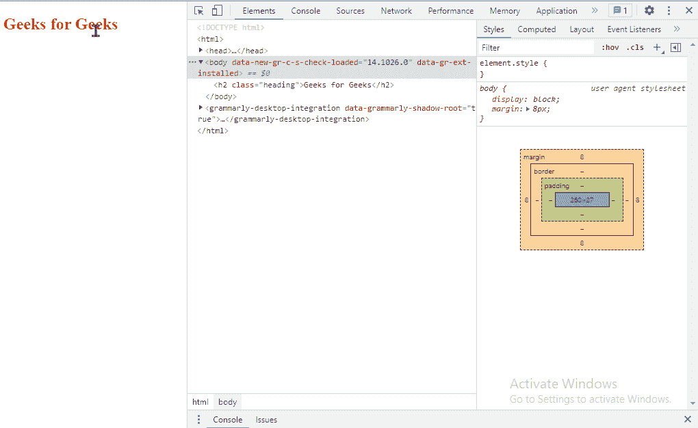
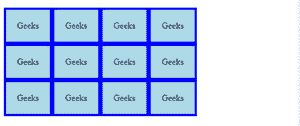
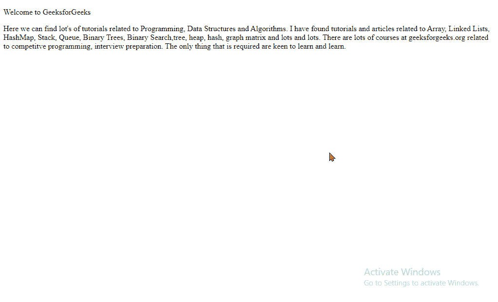
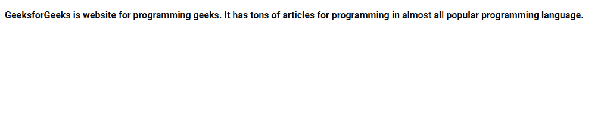
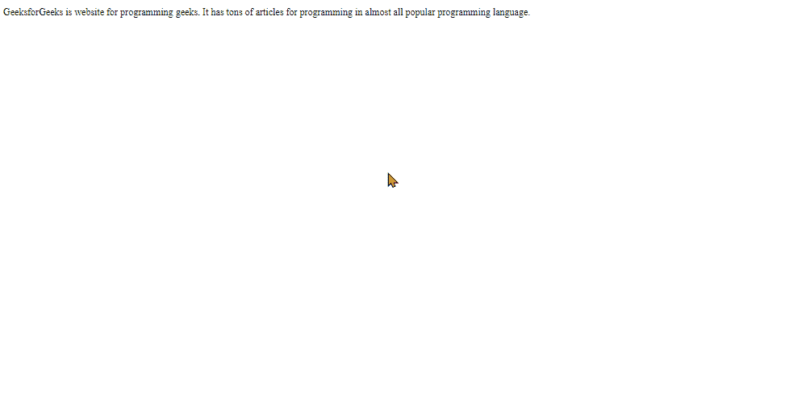
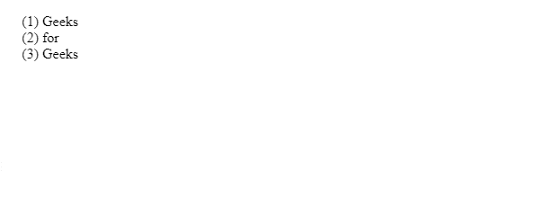

# 什么是 at-rules，为什么在 CSS 中使用“at”？

> 原文:[https://www . geeksforgeeks . org/什么是规则和为什么使用 css 中的规则/](https://www.geeksforgeeks.org/what-is-at-rules-and-why-use-of-at-in-css/)

在本教程中，我们将学习 At 规则及其在 CSS 中的用法。At-rules 只是一些指示 CSS 在特定条件下如何行为的 CSS 语句。ie。At-规则允许开发人员根据特定条件更改网站的设计或布局。每个 At-rule 命令都以**“@”**开头，后跟一个**标识符**，以分号**结尾**或下一个 CSS 区块。

**语法:**

*   **常规 At 规则:**

```html
@identifier (condition);
```

*   **嵌套 At 规则:**

```html
@identifier (condition) {}
```

我们将通过例子来理解这两种语法。让我们首先讨论@charset。

*   **@charset:** 定义网站要使用的字符集。如果 CSS 文件包含非 ASCII 字符，我们可以很容易地使用它。可以使用的字符集有 UTF-8、iso-8859-15、iso-8859-1 等。您可以查看任何特定的字符集，但最常见和最受欢迎的字符集是网站上的 UTF-8。

**示例:**

```html
@charset "UTF-8";
```

*   **@import:** 用于从位于本地系统或互联网的其他 CSS 文件中导入 CSS 样式或规则。通常在指示包含外部样式表的样式表顶部提到它。下面的例子说明了我们通常使用的各种@import。

**示例:**在本例中，我们将创建 index.html 文件以及所需的样式表。

**index.html**

## 超文本标记语言

```html
<!DOCTYPE html>
<html>

<head>
    <meta charset="utf-8" />
    <meta name="viewport" 
        content="width=device-width" />

    <title>GeeksforGeeks</title>

    <link href="style.css" 
        rel="stylesheet" type="text/css" />
</head>

<body>
    <h2 class="heading">GeeksforGeeks</h2>
</body>

</html>
```

在*index.html，*我们已经导入了 style.css，它将改变标题的颜色，标题是“GeeksforGeeks”。

**style.css:**

```html
@import 'mobile.css' screen and (max-width: 300px);
@import url('desktop.css') screen and (min-width: 300px);
```

**mobile.css:**

```html
.heading{
    color: red;  
}
```

**desktop.css:**

```html
.heading{
    color: green;  
}
```

**说明:**让我们一个个了解 CSS 文件。 *mobile.css* 文件将标题的颜色更改为红色，而 *desktop.css* 更改为绿色。现在，我们不再在单个文件上进行媒体查询，而是在桌面屏幕和移动屏幕上使用了两个不同的文件。你可以看到，我们用了*、*条件和*最大宽度*来保证媒体查询。

**输出:**在输出中，我们在浏览器上运行桌面和手机屏幕。



@导入

*   **@命名空间:**用来告诉 CSS 引擎所有的 XML 命名空间都要用在 CSS 样式表中。

**示例:**

```html
<!--Normal namespaces-->
@namespace url/String; /* Url or string of XML namespace */

<!--Prefixed namespace-->
@namespace anything url/String; /* Anything is identifie */
```

在选择器中使用它

```html
anything|title {your style}
```

*   **@media:** 用于基于媒体查询结果的 HTML 代码的一部分或一个块。例如，使用媒体屏幕宽度制作响应导航栏。

**示例:**在本例中，我们将对*index.html*使用与上面相同的代码。

## 超文本标记语言

```html
<!DOCTYPE html>
<html>

<head>
    <meta charset="utf-8" />
    <meta name="viewport" 
        content="width=device-width" />

    <style>
        .heading {
            color: red;
        }

        @media screen and (min-width: 450px) {
            .heading {
                color: green !important;
            }
        }
    </style>
</head>

<body>
    <h2 class="heading">GeeksforGeeks</h2>
</body>

</html>
```

**说明:**在这里，当屏幕宽度小于 450 px 时，标题的颜色将为红色，否则为绿色。@media 与屏幕一起使用，以获得我们想要检查屏幕宽度的正确上下文，条件是“最小宽度:450px”。您也可以使用更多的查询。

**输出:**



@媒体

*   **@support:** 用于了解浏览器的支持能力，即。如果条件满足，那么它将为这些元素应用样式。例如，如果浏览器支持网格。

**示例:**

## 超文本标记语言

```html
<!DOCTYPE html>
<html>

<head>
    <meta charset="utf-8" />
    <meta name="viewport" content="width=device-width" />
    <title>Geeks for geeks</title>
    <style>
        @supports (display: grid) {
            #lists {
                display: grid;
                grid-template-columns: auto auto auto auto;
            }

            #lists>div {
                padding: 20px;
                border: 4px solid blue;
                background-color: lightblue;
            }
        }
    </style>
</head>

<body>
    <div id="lists">
        <div>Geeks</div>
        <div>Geeks</div>
        <div>Geeks</div>
        <div>Geeks</div>
        <div>Geeks</div>
        <div>Geeks</div>
        <div>Geeks</div>
        <div>Geeks</div>
        <div>Geeks</div>
        <div>Geeks</div>
        <div>Geeks</div>
        <div>Geeks</div>
    </div>
</body>

</html>
```

**输出:**



网格布局

在这种情况下，如果浏览器不支持*显示:网格*属性，那么可以使用下面的代码:

```html
@supports not (display: grid)
{
 /*code for no grid support*/
}
```

*   **@page:** 用于修改一些 CSS 属性&在打印文档时将样式应用到单个页面。

**示例:**

## 超文本标记语言

```html
<!DOCTYPE html>
<html>

<head>
    <meta charset="utf-8" />
    <meta name="viewport" 
        content="width=device-width" />

    <style>
        @page {
            size: A5 landscape;
            margin: 2in;
        }
    </style>
</head>

<body>
    <div id="page">
        <p>Welcome to GeeksforGeeks</p>

        <p>
            Here we can find lot's of tutorials 
            related to Programming, Data Structures 
            and Algorithms. I have found tutorials 
            and articles related to Array, Linked 
            Lists, HashMap, Stack, Queue, Binary 
            Trees, Binary Search,tree, heap, hash, 
            graph matrix and lots and lots. There 
            are lots of courses at geeksforgeeks.org 
            related to competitve programming,
            interview preparation. The only thing 
            that is required are keen to learn and 
            learn.
        </p>
    </div>
</body>

</html>
```

**说明:**在@page at-rule 中，我们提到了应该如何打印页面的细节。如果您在网页上单击鼠标右键，会出现打印选项，打印时会显示指定的输出。

**输出:**



@page

*   **@font-face:** 指定显示文本的自定义字体。字体可以从服务器或系统的任何地方加载。首先，我们必须定义字体名称，然后提供要加载的字体的网址。

**示例:**

## 超文本标记语言

```html
<!DOCTYPE html>
<html>

<head>
    <meta charset="utf-8" />
    <meta name="viewport" 
        content="width=device-width" />

    <style>
        @font-face {
            font-family: "Roboto";
            src: url("Roboto/Roboto-Bold.ttf");
        }

        #page p {
            font-family: "Roboto";
        }
    </style>
</head>

<body>
    <div id="page">

        <p>
            GeeksforGeeks is website for programming 
            geeks. It has tons of articles for 
            programming in almost all popular 
            programming language.
        </p>
    </div>
</body>

</html>
```

我们需要从 fonts.google.com 下载 Roboto 字体，要下载点击[这里](https://fonts.google.com/download?family=Roboto)。确保它必须下载到 index.html 所在的工作目录中，以便正常工作。

**输出:**



@font-face

*   **@关键帧:**从一组 CSS 逐渐变成另一组 CSS 样式。

**示例:**

## 超文本标记语言

```html
<!DOCTYPE html>
<html>

<head>
    <meta charset="utf-8" />
    <meta name="viewport" content="width=device-width" />

    <style>
        #page {
            animation-duration: 3s;
            font-size: 24px;
            animation-name: gfgexpanding;
        }

        @keyframes gfgexpanding {
            from {
                font-size: 12px;
            }

            to {
                font-size: 24px;
            }
        }
    </style>
</head>

<body>
    <div id="page">
        <p>
            GeeksforGeeks is website for programming 
            geeks. It has tons of articles for 
            programming in almost all popular 
            programming language.
        </p>
    </div>
</body>

</html>
```

语法非常清楚。首先，我们已经将容器与动画链接起来。接下来，我们使用了与#page 中同名的@关键帧来制作动画。

**输出:**



@关键帧

此外，您可以提供如下百分比变化:

```html
@keyframes gfgexpanding{
  0%    {font-size: 12px;}
  25%    {font-size: 16px;}
  50%    {font-size: 18px;}
  100%    {font-size: 24px;}
}
```

*   **@计数器样式:**它允许您定义不属于预定义样式集的计数器样式。一个 **@counter-style** 规则定义了如何将一个计数器值转换成另一个字符串。

**语法:**

```html
@counter-style counter-style-name {
  system: system;
  symbols: symbols;
  additive-symbols: additive-symbols;
  negative: negative-symbol;
  prefix: prefix;
  suffix: suffix;
  range: range;
  pad: padding;
}
```

**示例:**

## 超文本标记语言

```html
<!DOCTYPE html>
<html>

<head>
    <meta charset="utf-8" />
    <meta name="viewport" 
        content="width=device-width" />

    <style>
        @counter-style mynums {
            system: numeric;
            symbols: "0""1""2""3""4""5""6""7""8""9";
            prefix: "(";
            suffix: ") ";
        }

        #gfg>ul {
            list-style-type: mynums;
        }
    </style>
</head>

<body>
    <div id="gfg">
        <ul>
            <li>Geeks</li>
            <li>for</li>
            <li>Geeks</li>
        </ul>
    </div>
</body>

</html>
```

这里重要的是制度。如果是字母，你必须提到所有的字符，如果是数字，必须提到所有的数字。

**输出:**



@反风格