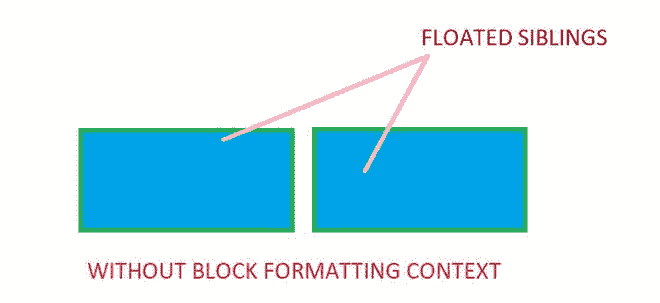
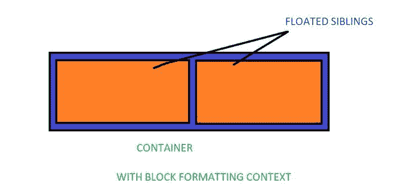
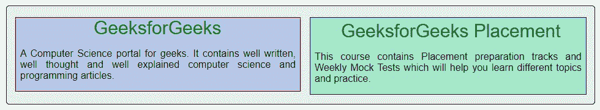
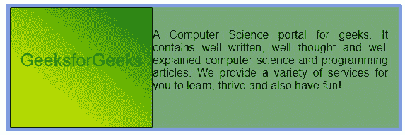

# 什么是 CSS 中的块格式化上下文？

> 原文:[https://www . geesforgeks . org/什么是块格式-css 中的上下文/](https://www.geeksforgeeks.org/what-is-block-formatting-context-in-css/)

在本文中，我们将了解 CSS 中的块格式上下文及其实现。块格式上下文是可视 CSS 的一部分，将显示在块框位于外部的网页上。正常流程是属于它的定位方案。这是一个区块框布局发生的区域，其中浮动与其他元素交互。根据 W3C 的说法:

> 浮动、绝对定位的元素、不是块框的块容器(如内联块、表格单元格和表格标题)以及具有“可见”以外的“溢出”的块框(除非该值已传播到视口)为其内容建立新的块格式上下文。

这些框从包含的顶部块开始，一个接一个地垂直放置。*边距*属性有助于确定两个兄弟框之间的垂直距离。它是一个 HTML 框，应该至少满足以下条件之一:

*   浮点值不应声明为 none。
*   位置值既不是静态的，也不是相对的。
*   显示值为表格单元格、表格标题、内联块、弹性或内联弹性。
*   溢出的值不应声明为可见。

下图说明了存在和不存在块格式上下文之间的区别。

*   不存在块格式上下文:



*   块格式上下文的存在:



我们将通过示例了解块格式上下文概念。

**示例 1:** 本示例通过使用*浮动*属性说明了块格式上下文的使用，该属性设置为*左侧*&*显示*属性&将其值设置为*内联块；*

## 超文本标记语言

```css
<!DOCTYPE html>
<html>

<head>
    <meta charset="utf-8" />

    <title>Block formatting Context in CSS</title>

    <style>
        .container {
            width: 960px;
            height: 160px;
            margin: 100px;
            border: 1px solid black;
            border-radius: 5px;
            background-color: rgb(230, 240, 235);
            font-family: sans-serif;
        }

        .block1 {
            float: left;
            border: 1px solid red;
            margin-top: 18px;
            margin-left: 14px;
            width: 450px;
            background-color: rgb(183, 199, 232);
            text-align: justify;
        }

        .block2 {
            display: inline-block;
            border: 1px solid navy;
            padding-top: 5px;
            margin-top: 18px;
            margin-left: 15px;
            width: 450px;
            background-color: rgb(165, 232, 202);
            text-align: justify;
        }

        span {
            color: green;
            font-size: 30px;
            margin-left: 50px;
        }

        .block1,
        .block2 p {
            padding: 0 7px;
        }

        .main {
            margin-left: 120px;
        }
    </style>
</head>

<body>
    <div class="container">
        <div class="block1">
            <span class="main">
                GeeksforGeeks
            </span>

            <p>
                A Computer Science portal for geeks. 
                It contains well written, well
                thought and well explained computer 
                science and programming articles.
            </p>
        </div>

        <div class="block2">
            <span class="submain">
                GeeksforGeeks Placement
            </span>

            <p>
                This course contains Placement 
                preparation tracks and Weekly Mock
                Tests which will help you learn 
                different topics and practice.
            </p>
        </div>
    </div>
</body>

</html>
```

**说明:**这里，我们已经声明了容器类来创建块格式上下文。在容器类中，我们定义了另外两个 div 标签，它们有 block1 & block2 类，在每个类中包含两个子 div，每个类都有 main &子类。我们已经为每个类声明了 CSS 属性。对于 block1 类，为了向左对齐，我们将 *float* 属性的值设置为 *left* ，同时将框的宽度设置为 450px。为了将第二个框与第一个框对齐，我们使用了*显示*属性，为此我们将值设置为*内嵌块。*我们还分别使用了 5px、18 px & 15 px 值的填充顶、页边距顶、左边距。

**输出:**



**示例 2:** 在本示例中，使用了*溢出*属性，该属性的值被设置为*自动*，该属性将剪切溢出&如果有任何内容，则它将添加滚动以显示其余内容。

## 超文本标记语言

```css
<!DOCTYPE html>
<html>

<head>
    <meta charset="utf-8" />
    <title>Block formatting Context in CSS</title>
    <style>
        .container {
            background-color: rgb(118, 171, 119);
            border: 5px solid #7d9ce8;
            border-radius: 3px;
            font-family: sans-serif;
            overflow: auto;
            width: 550px;
        }

        .subcontain {
            background-color: white;
            background-image: linear-gradient(
                to top right, yellow, green);
            border: 1px solid black;
            border-radius: 2px;
            color: green;
            float: left;
            font-size: 25px;
            height: 110px;
            padding-top: 60px;
            text-align: center;
            width: 200px;
        }

        .container p {
            padding: 15px;
            text-align: justify;
        }
    </style>
</head>

<body>
    <div class="container">
        <span class="subcontain">
            GeeksforGeeks
        </span>

        <p>
            A Computer Science portal for geeks. 
            It contains well written, well
            thought and well explained computer 
            science and programming articles. We
            provide a variety of services for 
            you to learn, thrive and also have
            fun!
        </p>
    </div>
</body>

</html>
```

**说明:**这里，我们已经用容器类&声明了 div 标签，用子容器类声明了 span 标签。为了将方框向左对齐，我们将*浮动*属性的值设置为*左侧，*还使用了*线性渐变*属性。

**输出:**



**优势:**

*   块格式化上下文防止边缘下降。
*   块格式化上下文停止内容环绕漂移。
*   块格式上下文有助于感知两种不同物质的对比。