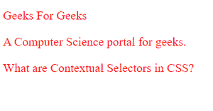
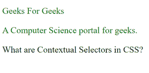

# CSS 中的上下文选择器是什么？

> 原文:[https://www . geesforgeks . org/什么是上下文选择器 in-css/](https://www.geeksforgeeks.org/what-is-contextual-selector-in-css/)

在本文中，我们将学习 CSS 中的上下文选择器&借助代码示例理解声明语法。
一个**上下文选择器**被定义为一个考虑应用样式的上下文的选择器。简而言之，只有当元素处于*指定的上下文中时，指定的样式才会应用于该元素。*上下文可以定义为文档不同部分之间的父/子关系或祖先/后代关系。上下文选择器由两个或多个由空格分隔的简单选择器组成。类，任何类型，ID 选择器都被认为是一个简单的选择器。

**后代:**它匹配包含在另一个元素中的所有元素。

**语法:**

```css
div {color: red}
p {color: red;}
```

对于任何特定的 HTML 元素，我们都可以应用设置该元素样式所需的通用 CSS 属性。下面的代码示例将说明应用上下文选择器的方法。

**示例:**在这个中，有一个父 [div](https://www.geeksforgeeks.org/div-tag-html/) 标签和它的两个子 [p](https://www.geeksforgeeks.org/html-paragraph/) 标签。父< p >标记和父< div >标记在程序执行时将元素变成红色。

## 超文本标记语言

```css
<!DOCTYPE html>
<html>

<head>
    <title>Contextual Selectors</title>

    <style>
        div {
            color: red;
        }

        p {
            color: red;
        }
    </style>
</head>

<body>
    <div>

<p>Geeks For Geeks</p>

<p>A Computer Science portal for geeks.</p>

    </div>

<p>What are Contextual Selectors in CSS?</p>

</body>

</html>
```

**输出:**



但是假设你只需要把在 div 下面的那一段变成绿色，而不是 div 外面的另一段。您希望整个文档的

和

标签都保持红色，但是对于标签内的元素，您需要将

标签变为绿色。你怎么能这么做？

上下文选择器的真正重要性来了。

**语法:**

```css
div p{color: green;}
```

**示例 2:** 在本例中，任何位于< div >标签内的< p >标签都将变成绿色(而不是前面指定的红色语法)。这里，< p >标签将仅在< div >标签的上下文中变为绿色。在其他所有上下文中，它都是红色的。

## 超文本标记语言

```css
<!DOCTYPE html>
<html>

<head>
    <title>Contextual Selectors</title>
    <style>
        div p {
            color: green;
        }
    </style>
</head>

<body>
    <div>

<p>Geeks For Geeks</p>

<p>A Computer Science portal for geeks.</p>

    </div>

<p>What are Contextual Selectors in CSS?</p>

</body>

</html>
```

**输出:**



从上面的例子中，我们已经看到了只有当元素在*指定的上下文中时，上下文选择器是如何应用于元素样式的。*

你好极客们！现在不要停止学习。通过[初学者网页设计](https://practice.geeksforgeeks.org/courses/web-design-html?utm_source=geeksforgeeks&utm_medium=article&utm_campaign=GFG_Article_Bottom_HTML) | HTML 课程掌握所有重要的竞争性编程概念。