# 什么是 CSS flexbox？

> 原文:[https://www.geeksforgeeks.org/what-is-css-flexbox/](https://www.geeksforgeeks.org/what-is-css-flexbox/)

**CSS 柔性布局框**，俗称 **Flexbox** 是一个强大的一维布局模型。它有助于在容器(父容器)中有效地放置、对齐和分发项目(子容器)。

**重要特征:**

*   **一维布局模型:** Flex 是一维布局模型，因为它只能以行的形式水平处理项目，或者以列的形式垂直处理项目。相反，CSS Grid 布局可以同时处理行和列。
*   **创建灵活且响应迅速的布局** : Flexbox 让 flex container 能够根据不同的屏幕大小定制其中的项目。flex 容器可以扩展其子项以填满可用空间，也可以收缩子项以防止溢出。
*   **方向不可知:**与块(垂直偏置)和线内(水平偏置)不同，Flexbox 不受任何方向限制。
*   **超级好用:**在 Flexbox 中对齐物品很容易，不像使用 float 和 positioning 有点让人沮丧，有时还很难使用。

**Flexbox 体系结构:**

弹性箱有两个方面:**弹性容器**和**弹性项目**

柔性项可以沿着主轴(从主起点开始，在主终点结束)或沿着横轴(从十字起点开始，在十字终点结束)进行布局。

*   **主轴:**根据弯曲方向，弯曲项目沿该轴水平或垂直布置。
*   **横轴:**垂直于主轴，其方向取决于主轴的方向。
*   **主要尺寸:**根据主要尺寸，是伸缩项的宽度/高度。
*   **交叉尺寸:**是根据交叉尺寸确定的伸缩项的宽度/高度。

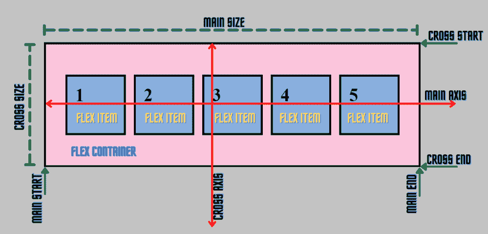

为了理解不同的 Flexbox 属性，让我们通过创建一个 HTML 文件和一个 CSS 文件来举个例子。

**示例:**

## 超文本标记语言

```html
<!DOCTYPE html>
<html lang="en">

<head>
    <meta charset="UTF-8" />
    <meta http-equiv="X-UA-Compatible" content="IE=edge" />
    <meta name="viewport" content="width=device-width, 
                   initial-scale=1.0" />
    <title>CSS Flexbox</title>
    <link rel="stylesheet" href="style.css" /> 
</head>

<body>
    <div class="container">
        <div class="item item-1">1</div>
        <div class="item item-2">2</div>
        <div class="item item-3">3</div>
        <div class="item item-4">4</div>
    </div>
</body>

</html>
```

这是我们的 CSS 代码，我们将在其中设置 flex 容器和 flex 项的样式。

## 半铸钢ˌ钢性铸铁(Cast Semi-Steel)

```html
.container {
  border: 5px solid rgb(0, 0, 0);
  background-color: rgb(245 197 221);
}
.item {
  border: 5px solid rgb(0, 0, 0);
  background-color: rgb(141, 178, 226);
  margin: 10px;
  padding: 20px;
  height: 100px;
  width: 100px;
  font-weight: bold;
  font-size: 45px;
}
```

**输出:**

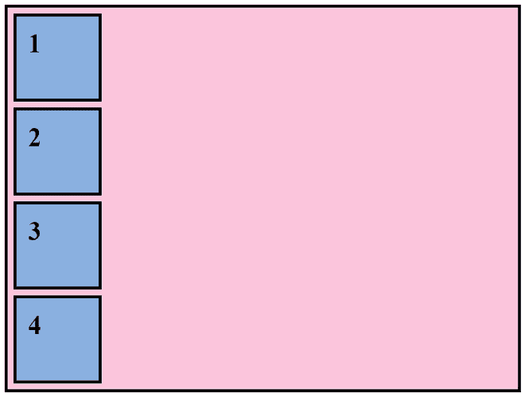

从上面的输出来看，默认情况下，项目是垂直对齐的，默认显示为*块级*。粉色区域是*集装箱*，里面的蓝色盒子是*物品。*

**父/柔性容器的属性:**

*   **显示:**让我们通过将其显示设置为在内部弯曲来使容器弯曲。我们的 CSS 文件的容器。

```html
.container{
    display: flex;
    border: 5px solid rgb(0, 0, 0);
    background-color: rgb(245 197 221);
}
```

**示例:**

## 超文本标记语言

```html
<!DOCTYPE html>
<html lang="en">

<head>
    <meta charset="UTF-8" />
    <meta http-equiv="X-UA-Compatible" content="IE=edge" />
    <meta name="viewport" content="width=device-width, 
                   initial-scale=1.0" />
    <title>CSS Flexbox</title>
    <style>
    .container {
        display: flex;
        border: 5px solid rgb(0, 0, 0);
        background-color: rgb(245 197 221);
    }

    .item {
        border: 5px solid rgb(0, 0, 0);
        background-color: rgb(141, 178, 226);
        margin: 10px;
        padding: 20px;
        height: 100px;
        width: 100px;
        font-weight: bold;
        font-size: 45px;
    }
    </style>
</head>

<body>
    <div class="container">
        <div class="item item-1">1</div>
        <div class="item item-2">2</div>
        <div class="item item-3">3</div>
        <div class="item item-4">4</div>
    </div>
</body>

</html>
```

**输出:**可以看到，在应用*显示:伸缩*属性后，项目已经水平对齐，因为伸缩框的默认伸缩方向是行。

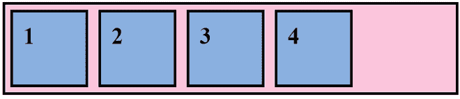

显示:伸缩

*   [**【伸缩方向】**](https://www.geeksforgeeks.org/css-flex-direction-property/) **:** 它设置伸缩容器主轴的方向，并指定项目将如何放置在容器内。

**语法:**

```html
flex-direction: attribute value
```

**属性值:**

*   **行:**柔性项沿一行水平显示。
*   **列:**柔性项沿列垂直显示。
*   **行反转:**弹性项沿一行水平显示，但顺序相反。
*   **列反转:**弹性项沿列垂直显示，但顺序相反。

**注意:**显示方向默认为行。

**示例:**

## 超文本标记语言

```html
<!DOCTYPE html>
<html lang="en">

<head>
    <meta charset="UTF-8" />
    <meta http-equiv="X-UA-Compatible" content="IE=edge" />
    <meta name="viewport" content="width=device-width, 
                   initial-scale=1.0" />
    <title>flex-direction</title>
    <link rel="stylesheet" href="style_flex-direction.css" /> 
</head>

<body>
    <ul class="container row">
        <li class="item">
            <p>1</p>
        </li>
        <li class="item">
            <p>2</p>
        </li>
        <li class="item">
            <p>3</p>
        </li>
        <li class="item">
            <p>4</p>
        </li>
    </ul>
    <ul class="container column">
        <li class="item">
            <p>1</p>
        </li>
        <li class="item">
            <p>2</p>
        </li>
        <li class="item">
            <p>3</p>
        </li>
        <li class="item">
            <p>4</p>
        </li>
    </ul>
    <ul class="container row-reverse">
        <li class="item">
            <p>1</p>
        </li>
        <li class="item">
            <p>2</p>
        </li>
        <li class="item">
            <p>3</p>
        </li>
        <li class="item">
            <p>4</p>
        </li>
    </ul>
    <ul class="container column-reverse">
        <li class="item">
            <p>1</p>
        </li>
        <li class="item">
            <p>2</p>

        </li>
        <li class="item">
            <p>3</p>
        </li>
        <li class="item">
            <p>4</p>
        </li>
    </ul>
</body>

</html>
```

**CSS 代码:**

## 半铸钢ˌ钢性铸铁(Cast Semi-Steel)

```html
.container {
  background-color: rgb(245 197 221);
  margin: 5px;
  padding: 0;
  float: left;
  height: 270px;
  width: 170px;
  border: 2px solid black;
  display: flex;
}
.row {
  flex-direction: row;
}
.column {
  flex-direction: column;
}
.row-reverse {
  flex-direction: row-reverse;
}
.column-reverse {
  flex-direction: column-reverse;
}
ul {
  list-style: none;
}
.item {
  background-color: rgb(141, 178, 226);
  padding: 5px;
  height: 40px;
  width: 40px;
  margin: 2px;
  padding: 2px;
  font-weight: bold;
  border: 2px solid black;
}
```

**输出:**

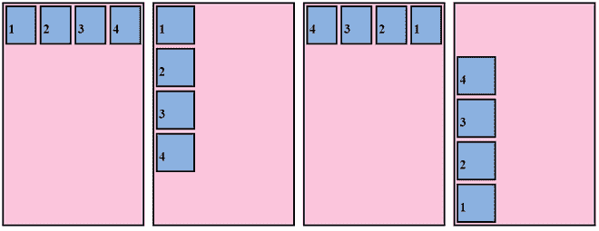

行，列，行反转，列反转

*   [](https://www.geeksforgeeks.org/css-flex-wrap-property/)****:**指定伸缩容器是单行还是多行。**

****语法:****

```html
flex-wrap: attribute value
```

****属性值:****

*   ****nowrap(默认):**它指定伸缩项不会换行，而是排成一行。这可能会导致弹性容器溢出。**
*   ****换行:**指定如果需要，伸缩项会换行，并且会多行布局。**
*   ****缠绕-反转:**与缠绕相同，但在这种情况下，伸缩项将以相反的顺序缠绕。**
*   ****初始值:**表示指定为属性初始值的值。**
*   ****inherit:** 它表示元素父元素的属性值。**

****注意:**我们增加了容器内部的物品数量，以便更好地理解折绕效果。**

****示例:****

## **超文本标记语言**

```html
<!DOCTYPE html>
<html lang="en">

<head>
    <meta charset="UTF-8" />
    <meta http-equiv="X-UA-Compatible" content="IE=edge" />
    <meta name="viewport" content="width=device-width, 
                   initial-scale=1.0" />
    <title>flex-wrap</title>
    <link rel="stylesheet" href="style_flex-wrap.css" /> 
</head>

<body>
    <ul class="container no-wrap">
        <li class="item">
            <p>1</p>
        </li>
        <li class="item">
            <p>2</p>
        </li>
        <li class="item">
            <p>3</p>
        </li>
        <li class="item">
            <p>4</p>
        </li>
        <li class="item">
            <p>5</p>
        </li>
        <li class="item">
            <p>6</p>
        </li>
        <li class="item">
            <p>7</p>
        </li>
        <li class="item">
            <p>8</p>
        </li>
    </ul>
    <ul class="container wrap">
        <li class="item">
            <p>1</p>
        </li>
        <li class="item">
            <p>2</p>
        </li>
        <li class="item">
            <p>3</p>
        </li>
        <li class="item">
            <p>4</p>
        </li>
        <li class="item">
            <p>5</p>
        </li>
        <li class="item">
            <p>6</p>
        </li>
        <li class="item">
            <p>7</p>
        </li>
        <li class="item">
            <p>8</p>
        </li>
    </ul>
    <ul class="container wrap-reverse">
        <li class="item">
            <p>1</p>
        </li>
        <li class="item">
            <p>2</p>
        </li>
        <li class="item">
            <p>3</p>
        </li>
        <li class="item">
            <p>4</p>
        </li>
        <li class="item">
            <p>5</p>
        </li>
        <li class="item">
            <p>6</p>
        </li>
        <li class="item">
            <p>7</p>
        </li>
        <li class="item">
            <p>8</p>
        </li>
    </ul>
</body>

</html>
```

****CSS 代码:****

## **半铸钢ˌ钢性铸铁(Cast Semi-Steel)**

```html
.container {
  background-color: rgb(245 197 221);
  margin: 5px;
  padding: 0;
  float: left;
  width: 250px;
  border: 2px solid black;
  display: flex;
}
.no-wrap {
  flex-wrap: nowrap;
}
.wrap {
  flex-wrap: wrap;
}
.wrap-reverse {
  flex-wrap: wrap-reverse;
}
ul {
  list-style: none;
}
.item {
  background-color: rgb(141, 178, 226);
  padding: 5px;
  height: 40px;
  width: 40px;
  margin: 2px;
  padding: 2px;
  font-weight: bold;
  border: 2px solid black;
}
```

****输出:****

**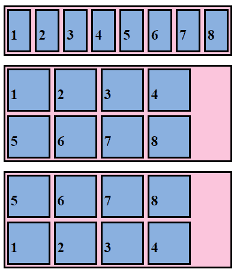

nowrap，包装，包装-反转** 

*   **[](https://www.geeksforgeeks.org/css-flex-flow-property/)****:**是伸缩方向和伸缩包裹的简写。默认情况下，折曲方向为**行**，折曲方向为**无折曲。******

******语法:******

```html
**flex-flow: flex-direction flex-wrap**
```

****例如，我们可以将 flex-direction 指定为一行，将 flex-wrap 指定为一个包装。****

```html
**.container{
flex-flow: row wrap;
}**
```

****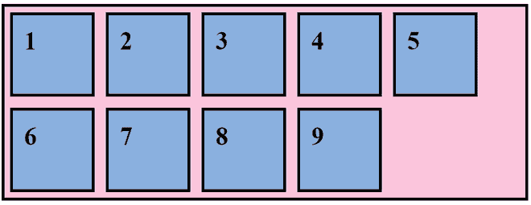

行换行**** 

*   ****[**正名-内容**](https://www.geeksforgeeks.org/css-justify-content-property/) **:** 它定义了项目如何沿着当前行的主/主轴定位。****

******语法:******

```html
**justify-content: attribute value**
```

******属性值:******

*   ******flex-start(默认):** Flex 项目位于容器的开头。****
*   ******伸缩端:**伸缩项位于容器的末端。****
*   ******中心:**柔性物品位于容器的中心。****
*   ******间距:** Flex 项目以均匀的间距分布，第一个项目将位于容器的开头，最后一个项目将位于容器的结尾。****
*   ******左右间隔:** Flex 项目以均匀的间隔分布，第一个项目的开始和最后一个项目的结束都有一半的空间。****
*   ******空间均匀:**伸缩项在对齐容器内沿主轴均匀分布。****
*   ******初始值:**表示指定为属性初始值的值。****

******示例:******

## ****超文本标记语言****

```html
**<!DOCTYPE html>
<html lang="en">

<head>
    <meta charset="UTF-8" />
    <meta http-equiv="X-UA-Compatible" content="IE=edge" />
    <meta name="viewport" content="width=device-width, 
                   initial-scale=1.0" />
    <title>justify-content</title>
    <link rel="stylesheet" href="style_justify-content.css" /> 
</head>

<body>
    <ul class="container flexStart">
        <li class="item">
            <p>1</p>
        </li>
        <li class="item">
            <p>2</p>
        </li>
        <li class="item">
            <p>3</p>
        </li>
        <li class="item">
            <p>4</p>
        </li>
        <li class="item">
            <p>5</p>
        </li>
    </ul>
    <ul class="container flexEnd">
        <li class="item">
            <p>1</p>
        </li>
        <li class="item">
            <p>2</p>
        </li>
        <li class="item">
            <p>3</p>

        </li>
        <li class="item">
            <p>4</p>
        </li>
        <li class="item">
            <p>5</p>

        </li>
    </ul>
    <ul class="container center">
        <li class="item">
            <p>1</p>
        </li>
        <li class="item">
            <p>2</p>
        </li>
        <li class="item">
            <p>3</p>
        </li>
        <li class="item">
            <p>4</p>
        </li>
        <li class="item">
            <p>5</p>
        </li>
    </ul>
    <ul class="container spaceBetween">
        <li class="item">
            <p>1</p>
        </li>
        <li class="item">
            <p>2</p>
        </li>
        <li class="item">
            <p>3</p>
        </li>
        <li class="item">
            <p>4</p>
        </li>
        <li class="item">
            <p>5</p>
        </li>
    </ul>
    <ul class="container spaceAround">
        <li class="item">
            <p>1</p>
        </li>
        <li class="item">
            <p>2</p>
        </li>
        <li class="item">
            <p>3</p>
        </li>
        <li class="item">
            <p>4</p>
        </li>
        <li class="item">
            <p>5</p>
        </li>
    </ul>
    <ul class="container spaceEvenly">
        <li class="item">
            <p>1</p>
        </li>
        <li class="item">
            <p>2</p>
        </li>
        <li class="item">
            <p>3</p>
        </li>
        <li class="item">
            <p>4</p>
        </li>
        <li class="item">
            <p>5</p>
        </li>
    </ul>
</body>

</html>**
```

******CSS 代码:******

## ****半铸钢ˌ钢性铸铁(Cast Semi-Steel)****

```html
**.container {
  background-color: rgb(245 197 221);
  margin: 5px;
  padding: 0;
  border: 2px solid black;
  display: flex;
}
.flexStart {
  justify-content: flex-start;
}
.flexEnd {
  justify-content: flex-end;
}
.center {
  justify-content: center;
}
.spaceBetween {
  justify-content: space-between;
}
.spaceAround {
  justify-content: space-around;
}
.spaceEvenly {
  justify-content: space-evenly;
}
ul {
  list-style: none;
}
.item {
  background-color: rgb(141, 178, 226);
  width: 50px;
  height: 50px;
  margin: 5px;
  line-height: 10px;
  font-weight: bold;
  border: 2px solid black;
}**
```

******输出:******

****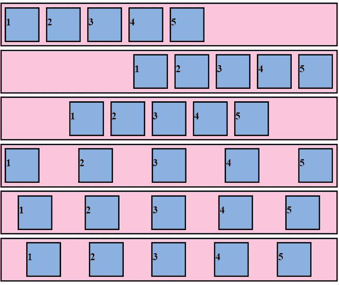

弹性起点、弹性终点、中心、间距、周围空间、均匀空间**** 

*   ****[**对齐内容**](https://www.geeksforgeeks.org/css-align-content-property/) **:** 当横轴有多余的空间时，对齐内容会对齐容器内的多行。它类似于对齐内容，即在主轴内对齐各个项目。****

******注意:**此属性仅在 Flexbox 有多行时有效。****

******语法:******

```html
**align-content: attribute value**
```

******属性值:******

*   ******开始弯曲:**线条向容器的开始对齐。****
*   ******弯曲端:**线朝向容器的末端对齐。****
*   ******中心:**线条向容器中心对齐。****
*   ******间距:**线条均匀分布，第一项在容器的开始，最后一项在容器的结束。****
*   ******左右空间:**线条均匀分布，第一项开始和最后一项结束各占一半空间。****
*   ******拉伸(默认):**线条拉伸占用剩余空间。****

******示例:******

## ****超文本标记语言****

```html
**<!DOCTYPE html>
<html lang="en">

<head>
    <meta charset="UTF-8" />
    <meta http-equiv="X-UA-Compatible" content="IE=edge" />
    <meta name="viewport" content="width=device-width, 
                   initial-scale=1.0" />
    <title>align-content</title>
    <link rel="stylesheet" href="style_align-content.css" />
</head>

<body>
    <ul class="container flexStart">
        <li class="item">
            <p>1</p>
        </li>
        <li class="item">
            <p>2</p>
        </li>
        <li class="item">
            <p>3</p>
        </li>
        <li class="item">
            <p>4</p>
        </li>
        <li class="item">
            <p>5</p>
        </li>
    </ul>
    <ul class="container flexEnd">
        <li class="item">
            <p>1</p>
        </li>
        <li class="item">
            <p>2</p>
        </li>
        <li class="item">
            <p>3</p>
        </li>
        <li class="item">
            <p>4</p>
        </li>
        <li class="item">
            <p>5</p>
        </li>
    </ul>
    <ul class="container center">
        <li class="item">
            <p>1</p>
        </li>
        <li class="item">
            <p>2</p>
        </li>
        <li class="item">
            <p>3</p>
        </li>
        <li class="item">
            <p>4</p>
        </li>
        <li class="item">
            <p>5</p>
        </li>
    </ul>
    <ul class="container spaceBetween">
        <li class="item">
            <p>1</p>
        </li>
        <li class="item">
            <p>2</p>
        </li>
        <li class="item">
            <p>3</p>
        </li>
        <li class="item">
            <p>4</p>
        </li>
        <li class="item">
            <p>5</p>
        </li>
    </ul>
    <ul class="container spaceAround">
        <li class="item">
            <p>1</p>

        </li>
        <li class="item">
            <p>2</p>

        </li>
        <li class="item">
            <p>3</p>
        </li>
        <li class="item">
            <p>4</p>

        </li>
        <li class="item">
            <p>5</p>
        </li>
    </ul>
    <ul class="container stretch">
        <li class="item">
            <p>1</p>
        </li>
        <li class="item">
            <p>2</p>
        </li>
        <li class="item">
            <p>3</p>

        </li>
        <li class="item">
            <p>4</p>
        </li>
        <li class="item">
            <p>5</p>
        </li>
    </ul>
</body>

</html>**
```

******CSS 代码:******

## ****半铸钢ˌ钢性铸铁(Cast Semi-Steel)****

```html
**.container {
  background-color: rgb(245 197 221);
  margin: 5px;
  float: left;
  height: 500px;
  width: 50px;
  border: 2px solid black;
  display: flex;
  flex-wrap: wrap;
  flex-direction: row;
}
.flexStart {
  align-content: flex-start;
}
.flexEnd {
  align-content: flex-end;
}
.center {
  align-content: center;
}
.spaceBetween {
  align-content: space-between;
}
.spaceAround {
  align-content: space-around;
}
.stretch {
  align-content: stretch;
}
ul {
  list-style: none;
}
.item {
  background-color: rgb(141, 178, 226);
  padding: 5px;
  width: 50px;
  margin: 5px;
  line-height: 10px;
  font-weight: bold;
  border: 2px solid black;
}**
```

******输出:******

****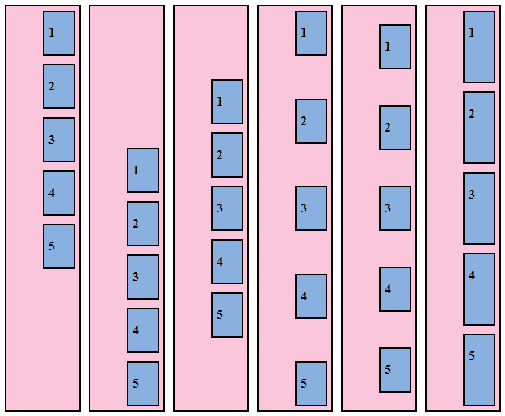

伸缩-开始、伸缩-结束、居中、间隔、环绕、拉伸**** 

*   ****[**对齐-项目**](https://www.geeksforgeeks.org/css-align-items-property/) **:** 定义伸缩项目如何沿着容器当前行的横轴对齐。****

******语法:******

```html
**align-items: stretch|center|flex-start|flex-end|baseline|initial|
inherit;**
```

******属性值:******

*   ******伸缩开始:**项目沿交叉开始线对齐。****
*   ******弯曲端:**项目沿交叉端线对齐。****
*   ******中心:**项目在横轴上居中。****
*   ******基线:**项目排成一行，使其基线对齐。****
*   ******拉伸(默认):**项目拉伸以填充容器。****

******示例:******

## ****超文本标记语言****

```html
**<!DOCTYPE html>
<html lang="en">

<head>
    <meta charset="UTF-8" />
    <meta http-equiv="X-UA-Compatible" content="IE=edge" />
    <meta name="viewport" content="width=device-width, 
                   initial-scale=1.0" />
    <title>align-item</title>
    <link rel="stylesheet" href="style_align-item.css" /> 
</head>

<body>
    <ul class="container flexStart">
        <li class="item">
            <p>1</p>
        </li>
        <li class="item">
            <p>2</p>
        </li>
        <li class="item">
            <p>3</p>
        </li>
        <li class="item">
            <p>4</p>
        </li>
        <li class="item">
            <p>5</p>
        </li>
    </ul>
    <ul class="container flexEnd">
        <li class="item">
            <p>1</p>
        </li>
        <li class="item">
            <p>2</p>
        </li>
        <li class="item">
            <p>3</p>
        </li>
        <li class="item">
            <p>4</p>
        </li>
        <li class="item">
            <p>5</p>
        </li>
    </ul>
    <ul class="container center">
        <li class="item">
            <p>1</p>
        </li>
        <li class="item">
            <p>2</p>
        </li>
        <li class="item">
            <p>3</p>
        </li>
        <li class="item">
            <p>4</p>
        </li>
        <li class="item">
            <p>5</p>
        </li>
    </ul>
    <ul class="container baseline">
        <li class="item">
           <p>1</p>
        </li>
        <li class="item">
            <p>2</p>
        </li>
        <li class="item">
            <p>3</p>
        </li>
        <li class="item">
            <p>4</p>
        </li>
        <li class="item">
            <p>5</p>
        </li>
    </ul>
    <ul class="container stretch">
        <li class="item">
            <p>1</p>
        </li>
        <li class="item">
            <p>2</p>
        </li>
        <li class="item">
            <p>3</p>
        </li>
        <li class="item">
            <p>4</p>
        </li>
        <li class="item">
            <p>5</p>
        </li>
    </ul>
</body>

</html>**
```

******CSS 代码:******

## ****半铸钢ˌ钢性铸铁(Cast Semi-Steel)****

```html
**.container {
  background-color: rgb(245 197 221);
  margin: 5px;
  float: left;
  height: 300px;
  width: 150px;
  border: 2px solid black;
  display: flex;
  flex-direction: row;
}
.flexStart {
  align-items: flex-start;
}
.flexEnd {
  align-items: flex-end;
}
.center {
  align-items: center;
}
.baseline {
  align-items: baseline;
}
.stretch {
  align-items: stretch;
}
ul {
  list-style: none;
}
.item {
  background-color: rgb(141, 178, 226);
  padding: 5px;
  width: 50px;
  line-height: 10px;
  font-weight: bold;
  border: 2px solid black;
}**
```

******输出:******

****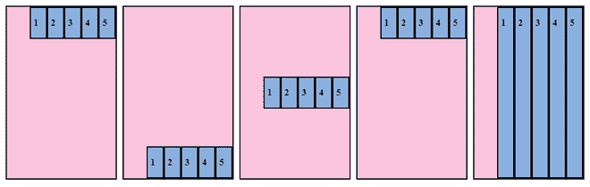

开始弯曲、结束弯曲、居中、基线、拉伸**** 

****具体区别请参考 [**对齐内容与对齐项目**](https://www.geeksforgeeks.org/difference-between-align-content-and-align-items/) 的区别一文。****

******子/弹性项的属性:******

*   ******顺序:**它指定伸缩容器的子容器在伸缩容器中出现的顺序。****

******语法:******

```html
**order: <integer>**
```

****弹性物料的默认订单值为 0。这就是为什么赋值大于 0 的项目出现在没有设置值的项目之后。相反的情况适用于值小于 0 的项目，它们出现在默认订单值或订单值大于 0 的项目之前。****

******示例:******

## ****超文本标记语言****

```html
**<!DOCTYPE html>
<html lang="en">

<head>
    <meta charset="UTF-8" />
    <meta http-equiv="X-UA-Compatible" content="IE=edge" />
    <meta name="viewport" content="width=device-width, 
                   initial-scale=1.0" />
    <title>order</title>
    <link rel="stylesheet" href="style_order.css" /> </head>

<body>
    <ul class="container">
        <li class="item item-1">
            <p>1</p>
        </li>
        <li class="item item-2">
            <p>2</p>
        </li>
        <li class="item item-3">
            <p>3</p>
        </li>
        <li class="item item-4">
            <p>4</p>
        </li>
        <li class="item item-5">
            <p>5</p>
        </li>
    </ul>
</body>

</html>**
```

******CSS 代码:******

## ****半铸钢ˌ钢性铸铁(Cast Semi-Steel)****

```html
**.container {
  background-color: rgb(245 197 221);
  margin: 0;
  padding: 0;
  float: left;
  height: 200px;
  width: 400px;
  border: 2px solid black;
  display: flex;
  flex-wrap: wrap;
  flex-direction: row;
}
ul {
  list-style: none;
}
.item {
  background-color: rgb(141, 178, 226);
  padding: 5px;
  margin: 5px;
  width: 50px;
  height: 50px;
  font-weight: bold;
  border: 2px solid black;
}
.item-1 {
  order: 3;
}
.item-4 {
  order: -3;
}**
```

******输出:**由于物料 1 有订单 3，其订单高于每个物料的订单，因此将其放在末尾，物料 4 放在开头，因为其订单(-3)是其他物料中最低的订单。****

****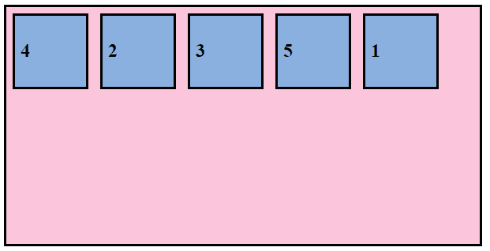****

****[**flex**](https://www.geeksforgeeks.org/css-flex-property/) **:** 它指定了灵活长度的组成部分，是以下内容的简写属性:****

*   ****[](https://www.geeksforgeeks.org/css-flex-grow-property/)****:**它指定了与该容器内的其他项目相比，该项目将增长多少。******
*   ****[](https://www.geeksforgeeks.org/css-flex-shrink-property/)****:**它指定了该物品相对于该容器内其他物品的收缩程度。******
*   ****[**【灵活基础】**](https://www.geeksforgeeks.org/css-flex-basis-property/) **:** 它指定了灵活项目的初始大小。****

******语法:******

```html
 **flex: flex-grow flex-shrink flex-basis|auto|initial|inherit;**
```

******示例:******

## ****超文本标记语言****

```html
**<!DOCTYPE html>
<html lang="en">

<head>
    <meta charset="UTF-8" />
    <meta http-equiv="X-UA-Compatible" content="IE=edge" />
    <meta name="viewport" 
          content="width=device-width, initial-scale=1.0" />
    <title>flex</title>
    <link rel="stylesheet" href="style_flex.css" /> </head>

<body>
    <ul class="container">
        <li class="item item-1">
            <p>1</p>
        </li>
        <li class="item item-2">
            <p>2</p>
        </li>
        <li class="item item-3">
            <p>3</p>
        </li>
        <li class="item item-4">
            <p>4</p>
        </li>
        <li class="item item-5">
            <p>5</p>
        </li>
    </ul>
</body>

</html>**
```

******CSS 代码:******

## ****半铸钢ˌ钢性铸铁(Cast Semi-Steel)****

```html
**.container {
  background-color: rgb(245 197 221);
  margin: 0;
  padding: 0;
  height: 500px;
  border: 2px solid black;
  display: flex;
}
ul {
  list-style: none;
}
.item {
  background-color: rgb(141, 178, 226);
  padding: 5px;
  margin: 5px;
  width: 50px;
  height: 50px;
  font-weight: bold;
  border: 2px solid black;
}
.item-1 {
  flex: 0 1 auto;
}
.item-2 {
  flex: 2 2 auto;
}
.item-3 {
  flex: 0 1 auto;
}
.item-4 {
  flex: 0 1 auto;
}
.item-5 {
  flex: 0 1 auto;
}**
```

******输出:**我们可以清楚的看到，伸缩值最高的项目 2 伸缩值最大。它的伸缩值和收缩值都为 2，而其他项目的伸缩值和收缩值分别为 0 和 1。所有项目的弹性基准已设置为自动。****

****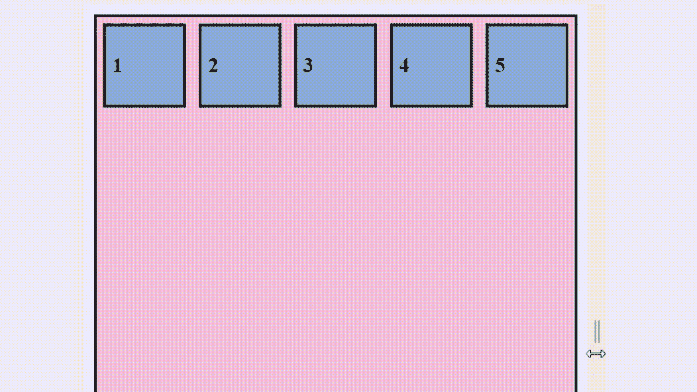****

*   ******伸缩-增长:**它设置伸缩项的伸缩-增长属性，并定义其增长能力。默认弹性增长值为 0。****

******语法:******

```html
**flex-grow: <number>** 
```

******注意:**负数无效。****

******示例:******

## ****超文本标记语言****

```html
**<!DOCTYPE html>
<html lang="en">

<head>
    <meta charset="UTF-8" />
    <meta http-equiv="X-UA-Compatible" content="IE=edge" />
    <meta name="viewport" content="width=device-width, 
                   initial-scale=1.0" />
    <title>flex-grow</title>
    <link rel="stylesheet" href="style_flex-grow.css" /> </head>

<body>
    <ul class="container">
        <li class="item item-1">
            <p>1</p>
        </li>
        <li class="item item-2">
            <p>2</p>
        </li>
        <li class="item item-3">
            <p>3</p>
        </li>
        <li class="item item-4">
            <p>4</p>
        </li>
        <li class="item item-5">
            <p>5</p>
        </li>
    </ul>
</body>

</html>**
```

******CSS 代码:******

## ****半铸钢ˌ钢性铸铁(Cast Semi-Steel)****

```html
**.container {
  background-color: rgb(245 197 221);
  margin: 0;
  padding: 0;
  height: 250px;
  border: 2px solid black;
  display: flex;
}
ul {
  list-style: none;
}
.item {
  background-color: rgb(141, 178, 226);
  padding: 5px;
  margin: 5px;
  width: 50px;
  height: 50px;
  font-weight: bold;
  border: 2px solid black;
}
.item-1 {
  flex-grow: 0;
}
.item-2 {
  flex-grow: 2;
}
.item-3 {
  flex-grow: 0;
}
.item-4 {
  flex-grow: 0;
}
.item-5 {
  flex-grow: 0;
}**
```

******输出:**我们可以清楚地看到，flex-grow 值比其他项目多的项目 2 比其他四个项目扩展得多。****

****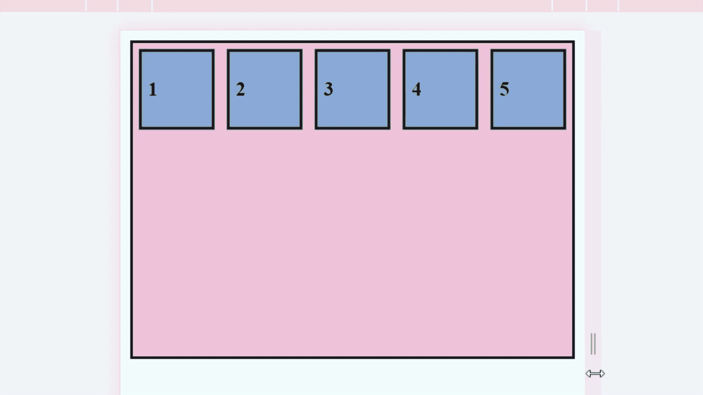****

*   ******伸缩收缩:**设置伸缩项的伸缩收缩属性，定义伸缩项收缩的能力。默认弹性增长值为 1。****

******语法:******

```html
**flex-shrink: <number>** 
```

******注意:**负数无效。****

******示例:******

## ****超文本标记语言****

```html
**<!DOCTYPE html>
<html lang="en">

<head>
    <meta charset="UTF-8" />
    <meta http-equiv="X-UA-Compatible" content="IE=edge" />
    <meta name="viewport" 
          content="width=device-width, initial-scale=1.0" />
    <title>flex-shrink</title>
    <link rel="stylesheet" href="style_flex-shrink.css" /> </head>

<body>
    <ul class="container">
        <li class="item item-1">
            <p>1</p>
        </li>
        <li class="item item-2">
            <p>2</p>
        </li>
        <li class="item item-3">
            <p>3</p>
        </li>
        <li class="item item-4">
            <p>4</p>
        </li>
        <li class="item item-5">
            <p>5</p>
        </li>
    </ul>
</body>

</html>**
```

******CSS 代码:******

## ****半铸钢ˌ钢性铸铁(Cast Semi-Steel)****

```html
**.container {
  background-color: rgb(245 197 221);
  margin: 0;
  padding: 0;
  height: 250px;
  border: 2px solid black;
  display: flex;
}
ul {
  list-style: none;
}
.item {
  background-color: rgb(141, 178, 226);
  padding: 5px;
  margin: 5px;
  width: 50px;
  height: 50px;
  font-weight: bold;
  border: 2px solid black;
}
.item-1 {
  flex-shrink: 1;
}
.item-2 {
  flex-shrink: 2;
}
.item-3 {
  flex-shrink: 1;
}
.item-4 {
  flex-shrink: 1;
}
.item-5 {
  flex-shrink: 1;
}**
```

******输出**:我们可以清楚的看到，伸缩值大于其他的第 2 项比其他四项收缩的更多。****

****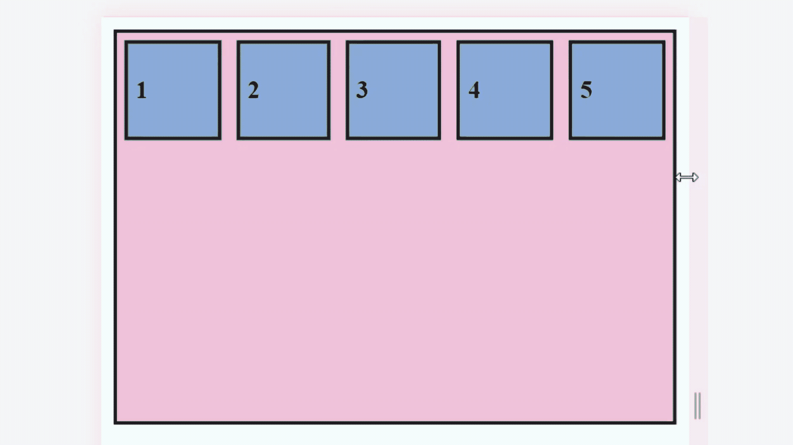****

*   ******弹性基础:**定义弹性项目的初始大小。****

******语法:******

```html
**flex-basis: content | <'width'>**
```

******示例:******

## ****超文本标记语言****

```html
**<!DOCTYPE html>
<html lang="en">

<head>
    <meta charset="UTF-8" />
    <meta http-equiv="X-UA-Compatible" content="IE=edge" />
    <meta name="viewport" 
          content="width=device-width, initial-scale=1.0" />
    <title>flex-basis</title>
    <link rel="stylesheet" href="style_flex-basis.css" /> </head>

<body>
    <ul class="container">
        <li class="item px">
            <p>px</p>
        </li>
        <li class="item percentage">
            <p>percentage</p>
        </li>
        <li class="item auto">
            <p>auto</p>
        </li>
        <li class="item initial">
            <p>initial</p>
        </li>
        <li class="item inherit">
            <p>inherit</p>
        </li>
    </ul>
</body>

</html>**
```

******CSS 代码:******

## ****半铸钢ˌ钢性铸铁(Cast Semi-Steel)****

```html
**.container {
  background-color: rgb(245 197 221);
  padding: 0;
  margin: 0;
  height: 250px;
  border: 2px solid black;

  display: flex;
}
ul {
  list-style: none;
}
.item {
  background-color: rgb(141, 178, 226);
  padding: 5px;
  margin: 5px;
  width: 50px;
  height: 50px;
  font-weight: bold;
  border: 2px solid black;
}
.px {
  flex-basis: 50px;
}
.percentage {
  flex-basis: 75%;
}
.auto {
  flex-basis: auto;
}
.initial {
  flex-basis: initial;
}
.inherit {
  flex-basis: inherit;
}**
```

******输出:******

****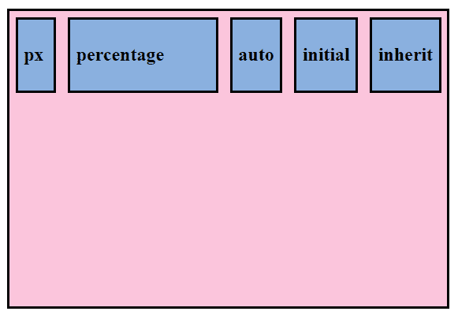****

*   ****[**【自动对齐】**](https://www.geeksforgeeks.org/css-align-self-property/) **:** 它定义了单个伸缩项如何沿横轴对齐。****

******语法:******

```html
**align-self: auto|stretch|center|flex-start|flex-end|baseline|
initial|inherit;**
```

******属性值:******

*   ******伸缩-开始:**在容器的开头对齐项目。****
*   ******弯曲端:**在容器末端对齐项目。****
*   ******居中:**将项目对齐容器的中心。****
*   ******拉伸:**对齐物品以适合容器。****
*   ******基线:**将项目与容器的基线对齐。****
*   ******自动(默认):**项继承父容器的 align-items 属性。****
*   ******初始值:**设置为默认值。****
*   ******继承:**项从其父元素继承 align-self 属性。****

******示例:******

## ****超文本标记语言****

```html
**<!DOCTYPE html>
<html lang="en">

<head>
    <meta charset="UTF-8" />
    <meta http-equiv="X-UA-Compatible" content="IE=edge" />
    <meta name="viewport" 
          content="width=device-width, initial-scale=1.0" />
    <title>align-self</title>
    <link rel="stylesheet" href="style_align-self.css" /> </head>

<body>
    <ul class="container">
        <li class="item flex-start">
            <p>1</p>
        </li>
        <li class="item flex-end">
            <p>2</p>
        </li>
        <li class="item center">
            <p>3</p>
        </li>
        <li class="item stretch">
            <p>4</p>
        </li>
        <li class="item baseline">
            <p>5</p>
        </li>
    </ul>
</body>

</html>**
```

******CSS 代码:******

## ****半铸钢ˌ钢性铸铁(Cast Semi-Steel)****

```html
**.container {
  background-color: rgb(245 197 221);
  padding: 0;
  margin: 0;
  height: 250px;
  border: 2px solid black;
  display: flex;
}
ul {
  list-style: none;
}
.item {
  background-color: rgb(141, 178, 226);
  padding: 5px;
  width: 100px;
  margin: 5px;
  line-height: 100px;
  font-weight: bold;
  border: 2px solid black;
}
.flex-start {
  align-self: flex-start;
}
.flex-end {
  align-self: flex-end;
}
.center {
  align-self: center;
}
.stretch {
  align-self: stretch;
}
.baseline {
  align-self: baseline;
}**
```

******输出:******

****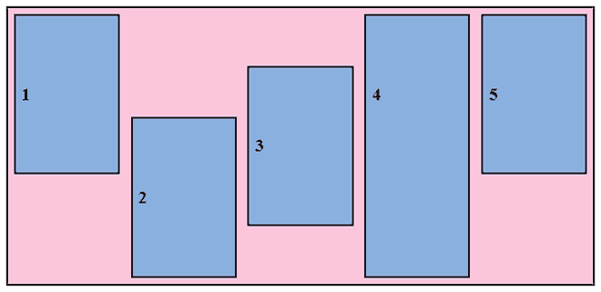

开始弯曲、结束弯曲、居中、拉伸、基线**** 

******支持的浏览器:******

*   ****谷歌 Chrome 29.0****
*   ****Firefox 22.0****
*   ****微软边缘 12.0****
*   ****Internet Explorer 11+****
*   ****Opera 48.0****
*   ****Safari 10.0****