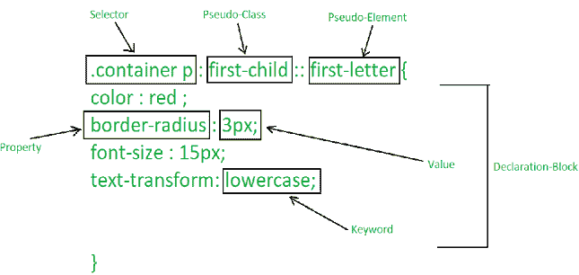
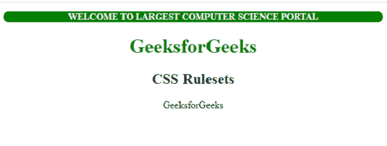
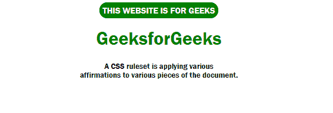

# 什么是 CSS 规则集？

> 原文:[https://www.geeksforgeeks.org/what-is-css-ruleset/](https://www.geeksforgeeks.org/what-is-css-ruleset/)

CSS 规则集是对文档各部分或元素的各种确认。目标是在连接的 HTML 页面中，为某个单独的组件或组件的特定排列应用一组属性。

**CSS 规则集可视化:**



CSS 规则集

“”在开头表示创建的规则将是一个类，同样“容器”表示[选择器](https://www.geeksforgeeks.org/css-syntax-and-selectors/)的名称。类似地，“第一个孩子”表示[伪类](https://www.geeksforgeeks.org/css-pseudo-classes/)，花括号内的元素是声明块的元素，声明块包含一些 CSS 属性及其对应的值。当在主网页上调用选择器名称时，将应用 CSS 规则集。

CSS 规则集是 CSS 样式表的主要构建块。

**示例 1:** 下面的代码演示了 CSS 规则集在各种 HTML 元素上的应用。类名用于给出属性及其相应的值。[:第一个子元素](https://www.geeksforgeeks.org/css-first-child-selector/)选择器用于选择那些元素，这些元素是 HTML[“p”](https://www.geeksforgeeks.org/html-paragraph/)元素的第一个子元素，如下图所示。

## 超文本标记语言

```html
<!DOCTYPE html>
<html>

<head>
    <title>Rulesets in CSS</title>
    <style>
        h1 {
            color: green;
        }
        /* Selector */
        p:first-child{ 

            /* Declaration-block */
            background-color: green;
            color: white;
            font-size: 15px;
            border-radius: 50px        
            ;
            text-transform: uppercase                
            ;
            font-weight: bold;
        }

        body {
            text-align: center;
        }
    </style>
</head>

<body>
    <div>
        <p>Welcome To Largest Computer Science portal</p>

        <h1>GeeksforGeeks</h1>
        <h2>CSS Rulesets</h2>

        <p>GeeksforGeeks </p>

    </div>
</body>
</html>
```

**输出:**



**示例 2:** 下面的代码还为各种 HTML 元素应用了一些不同的 CSS 规则集。

## 超文本标记语言

```html
<!DOCTYPE html>
<html>
  <head>
    <title>Rulesets in CSS</title>
    <style>
      h1 {
        color: green;
      }

      /* Selector */
      span {

        /* Declaration-block */
        background-color: green;
        color: white;
        padding: 5px;
        font-size: 15px;
        border-radius: 50px;
        text-transform: uppercase;
      }

      h2 {
        font-size: small;
      }

      .divClass {
        font-family: "Franklin Gothic Medium", 
                     "Arial Narrow", Arial, sans-serif;
      }

      body {
        text-align: center;
      }
    </style>
  </head>

  <body>
    <div class="divClass">
      <span> This website is for geeks </span>
      <h1>GeeksforGeeks</h1>
      <h2>
        A CSS ruleset is applying various <br />
        affirmations to various pieces of the document.
      </h2>
    </div>
  </body>
</html>
```

**输出:**



CSS 规则集