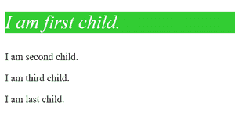

# CSS 中的第一个孩子是什么？

> 原文:[https://www.geeksforgeeks.org/what-is-first-child-in-css/](https://www.geeksforgeeks.org/what-is-first-child-in-css/)

**第一个子元素**是 CSS 中的一个伪类，它代表了一组兄弟元素中的第一个元素。**:第一个子元素**选择器用于针对其父元素的第一个子元素进行造型。

**语法:**

```css
:first-child {
 //property
}
```

**示例:**

## 超文本标记语言

```css
<!DOCTYPE html> 
<html> 

<head> 
    <style> 
        p:first-child { 
            background: limegreen; 
            color: white; 
            font-style: italic; 
            font-size: 1.875em; 
        } 
    </style> 
</head> 

<body> 
    <p>I am first child.</p>
    <p>I am second child.</p>
    <p>I am third child.</p>
    <p>I am last child.</p>
</body> 

</html> 
```

**输出:**

