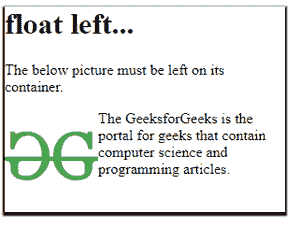

# CSS 中的 float 属性是什么？

> 原文:[https://www . geesforgeks . org/what-is-float-property-in-CSS/](https://www.geeksforgeeks.org/what-is-float-property-in-css/)

在本文中，我们将通过所有可用属性的适当示例来了解 CSS float 属性。

float 属性用于更改元素的正常流动。它定义了一个元素应该如何浮动，并将一个元素放在其容器的右侧或左侧。

#### float 属性的一般语法。

```html
float: none|inherit|left|right|initial;
```

注意–float 属性的默认值是 none，它不适用于绝对定位的元素。

## 浮点的属性值

<figure class="table">

| 价值 | 描述 |
| --- | --- |
| 没有人 | 这是浮点属性的默认值。元素不能浮动。 |
| 继承 | 属性必须从其父元素继承。 |
| 左边的 | 将元素放在其容器的右侧。 |
| 正确 | 将元素放在其容器的左侧。 |
| 最初的 | 属性设置为其默认值。 |

</figure>

### 使用左浮点值的浮点属性示例。

在下面的例子中，我们使用左边的浮点值。使用此值后，元素必须留在其容器中，如下图所示。



浮动:左侧

## 超文本标记语言

```html
<!DOCTYPE html>
<html>
<head>
    <title>Float Left</title>
    <style>
        img {
        float:left; /* element must be left on its container */
        height: 100px;
        }
        div{
            width:300px;
            height: 220px;
            box-shadow: 0px 2px 2px 2px;
        }
        </style>
</head>
<body>
    <div>
        <h1> float left...</h1>

<p>The below picture must be left on its container.</p>

      

<p>The GeeksforGeeks is the portal for geeks
   that contain computer science and programming 
  articles. </p>

    </div>
</body>
</html>                    
```