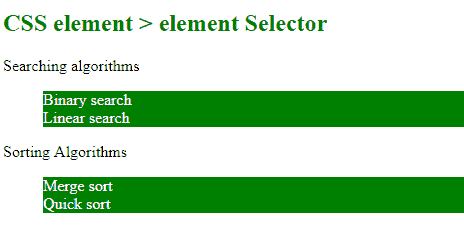
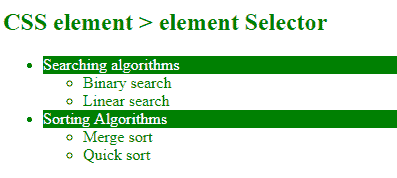

# CSS 中的大于号(>)选择器是什么？

> 原文:[https://www . geeksforgeeks . org/什么是大于符号选择器 in-css/](https://www.geeksforgeeks.org/what-is-greater-than-sign-selector-in-css/)

CSS 中的大于号(>)选择器用于选择具有特定父元素的元素。称为*元素>元素*选择器。它也被称为子组合选择器，这意味着它只选择那些父元素的直接子元素。它在标记结构中只向下看了一层，而不是更深。不选择不是指定父代的直接子代的元素。

**语法:**

```html
element > element {
    // CSS Property
}
```

**示例-1:** 本示例描述了大于>选择器。

```html
<!DOCTYPE html> 
<html> 
    <head> 
        <title> 
            CSS element > element Selector 
        </title> 
        <style> 
            ul > li { 
                color:white; 
                background: green; 
            } 
        </style> 
    </head> 
    <body> 
        <h2 style = "color:green;"> 
            CSS element > element Selector 
        </h2> 

        <div>Searching algorithms</div> 

        <ul> 
            <li>Binary search</li> 
            <li>Linear search</li> 
        </ul> 

        <p>Sorting Algorithms</p> 
        <ul> 
            <li>Merge sort</li> 
            <li>Quick sort</li> 
        </ul> 
    </body> 
</html> 
```

**输出:**


**例 2:** 本例描述了大于>选择器。

```html
<!DOCTYPE html> 
<html> 
    <head> 
        <title> 
            CSS element > element Selector 
        </title> 

        <!-- style to set element > element selector -->
        <style> 
            li > div { 
                color:white; 
                background: green; 
            } 
            ul > li {
                color: green;
            }
        </style> 
    </head> 

    <body> 
        <h2 style = "color:green;"> 
            CSS element > element Selector 
        </h2> 

        <ul>
            <li>
                <div>Searching algorithms</div> 

                <ul> 
                    <li>Binary search</li> 
                    <li>Linear search</li> 
                </ul>
            </li> 

            <li>
                <div>Sorting Algorithms</div> 
                <ul> 
                    <li>Merge sort</li> 
                    <li>Quick sort</li> 
                </ul>
            </li>
        </ul>
    </body> 
</html> 
```

**输出:**


CSS 是网页的基础，通过设计网站和网络应用程序用于网页开发。你可以通过以下 [CSS 教程](https://www.geeksforgeeks.org/css-tutorials/)和 [CSS 示例](https://www.geeksforgeeks.org/css-examples/)从头开始学习 CSS。