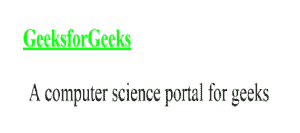

# 最好的包含 CSS 文件的方式是什么？为什么使用@import？

> 原文:[https://www . geesforgeks . org/什么是包含 css 文件的最佳方式-为什么要使用-导入/](https://www.geeksforgeeks.org/what-is-the-best-way-to-include-css-file-why-use-import/)

CSS 属性可以以多种不同的方式包含在 HTML 页面中。HTML 文档是根据样式表中包含的信息进行格式化的。
包含 CSS 文件的方式有很多种，列举如下:

*   **外部样式表(使用 HTML <链接>标签):**外部 CSS 包含单独的 CSS 文件，借助标签属性(例如类、id、标题等)仅包含样式属性。属性编写在一个单独的文件中。css 扩展，应该使用链接标签链接到 HTML 文档。这意味着对于每个元素，样式只能设置一次，并且将跨网页应用。链接标签用于链接外部样式表和 html 网页。

```html
<link rel="stylesheet" href="style.css">
```

*   **外部样式表(使用@import At-Rule):** At-rule 方法必须包含在<样式>标签中，或者包含在样式表中。

```html
<style>
@import url(style.css);
</style>
```

*   **内部样式表(使用<样式>元素):**这可以在单个 HTML 文档必须唯一设置样式时使用。CSS 规则集应该在标题部分的 HTML 文件中，即 CSS 嵌入在 HTML 文件中。

```html
<style>
element {
    // CSS property
}
</style>
```

*   **内联样式**内联 CSS 包含的 CSS 属性在正文部分附带的元素被称为内联 CSS。这种样式是使用样式属性在 HTML 标记中指定的。它用于为单个元素应用独特的样式。

```html
<h1 style="style property">Geeksforgeeks</h1>
```

**最佳方法:**外部样式表(使用 HTML <链接>标签)是用于链接元素的最佳方法。跨不同页面维护和重用 CSS 文件既简单又高效。<链接>标签放置在 HTML <头>元素中。要为级联样式表<指定媒体类型=“文本/css”，请键入>属性，该属性用于忽略浏览器中不支持的样式表类型。
**例 1:** 下面给出的文件包含 CSS 属性。此文件与一起保存。css 扩展。例如:极客

```html
body {
    background-color:powderblue;
}
.main {
    text-align:center;   
}
.GFG {
    color:#009900;
    font-size:50px;
    font-weight:bold;
}
#geeks {
    font-style:bold;
    font-size:20px;
} 
```

## 超文本标记语言

```html
<!DOCTYPE html>
<html>
    <head>
        <link rel="stylesheet" href="geeks.css"/>
    </head>
    <body>
        <div class = "main">
        <div class ="GFG">GeeksForGeeks</div>
        <div id ="geeks">A computer science portal for geeks</p>

        </div>
    </body>
</html>    
```

**输出:**


**示例 2:** 本示例描述了内部或嵌入式 CSS。

## 超文本标记语言

```html
<!DOCTYPE html>
<html>
    <head>
        <title>Internal CSS</title>
        <style>
            .main {
                text-align:center;
            }
            .GFG {
                color:#009900;
                font-size:50px;
                font-weight:bold;
            }
            .geeks {
                font-style:bold;
                font-size:20px;
            }
        </style>
    </head>
    <body>
        <div class = "main">
        <div class ="GFG">GeeksForGeeks</div>
        <div class ="geeks">A computer science portal for geeks</p>

        </div>
    </body>
</html>                    
```

**输出:**


**示例 3:** 这个示例描述了内联 CSS。

## 超文本标记语言

```html
<!DOCTYPE html>
<html>
    <head>
        <title>Inline CSS</title>
    </head>

    <body>
        <p style = "color:#009900;
                    font-size:50px;
                    font-style:italic;
                    text-align:center;">
        GeeksForGeeks</p>

    </body>
</html>                    
```

**输出:**


**@导入规则:**@导入规则用于将一个样式表导入到另一个样式表中。此规则还支持媒体查询，以便用户可以导入依赖于媒体的样式表。@import 规则必须在任何@charset 声明之后的文档顶部声明。
进口特色:

*   @import at 规则用于将样式表导入到 HTML 页面或其他样式表中。
*   @ import at-规则也用于添加媒体查询，因此导入依赖于媒体。
*   它总是在文档的顶部声明。

**语法:**

```html
@import url|string list-of-mediaqueries;
```

**房产价值:**

*   **URL |字符串:**URL 或字符串表示要导入的资源的位置。url 可以是相对的，也可以是绝对的。
*   **媒体查询列表:**媒体查询列表决定了链接网址中定义的 CSS 规则的应用。

**示例 1:** 考虑如下所示的两个 CSS 文件。

*   **icss.css**

```html
@import url("i1css.css");
h1 {
    color: #00ff00;
}
```

*   **CSS . CSS**

```html
h1 {
   text-decoration: underline;
   font-size:60px;
}

p {
   padding-left: 20px;
   font-size: 60px;
}
```

## 超文本标记语言

```html
<!DOCTYPE html>
<html>
<head>
    <title>WebPage</title>
    <link href="icss.css" rel="stylesheet">
</head>

<body>
    <h1>GeeksforGeeks</h1>

<p>A computer science portal for geeks</p>

</body>
</html>                    
```

**输出:**



**例 2:**

## 超文本标记语言

```html
<!DOCTYPE html>
<html>

<head>
    <title>@import property</title>

    <style type="text/css">
        @import url(
"https://media.geeksforgeeks.org/wp-content/uploads/imp.css");
    </style>
</head>

<body>
    <div id = "Geeks">

        <h1>GeeksforGeeks</h1>

        <h2>External style sheet (Using @import At-rule)</h2>
    </div>
</body>

</html>                   
```

**输出:**


**支持的浏览器:**

*   谷歌 Chrome 1.0
*   Internet Explorer 5.5
*   Firefox 1.0
*   歌剧 3.5
*   Safari 1.0