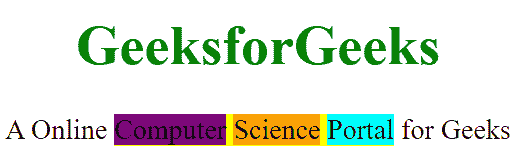

# CSS 中内联 flex 和内联 block 有什么区别？

> 原文:[https://www . geeksforgeeks . org/内联 flex 和内联 css 块之间的区别是什么/](https://www.geeksforgeeks.org/what-is-the-difference-between-inline-flex-and-inline-block-in-css/)

display 属性指定元素在网页中的显示方式。CSS 中可以有许多与该属性相关的值。内联块和内联 flex 就是两个这样的属性。虽然这个属性可以有几个值，但是为了理解前面提到的，让我们先来看看另外三个值:内联、块、flex。

*   [**内联:**](https://www.geeksforgeeks.org/html-block-and-inline-elements/) 顾名思义，内联显示一个元素与其余元素在同一行。指定任何高度和宽度属性都没有用，因为它遵循线条的高度和宽度，而线条是线条的一部分。
*   [**块:**](https://www.geeksforgeeks.org/html-block-and-inline-elements/) 将元素显示为块元素。它从一条新的线开始，尽可能多地占据水平空间。块级元素不会出现在同一行中，但会打断现有行并出现在下一行中。
*   [**Flex:**](https://www.geeksforgeeks.org/css-flex-property/) Flex 将元素显示为柔性结构。要使用 flex 显示，必须创建一个 flex 级别的容器。Flex 级别的容器什么都不是，而是一个显示属性设置为 flex 的元素。flex 容器本身显示在一个新行中，就像 block 元素一样。flex 容器中可以包含其他元素，因此 flex 容器是父元素，而属于它的元素是子元素。Display flex 属性帮助我们在容器中的项目之间对齐和分配空间，即使它们的大小是未知的和/或动态的。

**内联块:**将元素显示为内联级块容器。设置为 inline-block 的元素与 inline 非常相似，因为它将根据文本的自然流动进行设置，即；与 display: block 不同，display:inline-block 不会在元素后添加换行符。因此，该元素可以位于其他元素旁边。元素本身被格式化为内嵌元素，但是它允许您在元素上设置宽度和高度，这在**显示:内嵌**中是不可能的。
**例:**

## 超文本标记语言

```css
<!DOCTYPE html>
<html>
<title>CSS inline-block</title>
<style>
    body {
        text-align: center;
        font-size: 28px;
    }

    h1 {
        color: green;
    }
</style>

<body>
    <h1>GeeksforGeeks</h1> A Online
    <div style="display:inline-block; background-color:yellow; width:auto; height:auto">
        <div style="display:inline; background-color:purple;">Computer</div>
        <div style="display:inline; background-color:orange;">Science</div>
        <div style="display:inline; background-color:cyan;">Portal</div>
    </div>
    for Geeks</body>

</html>
```

**输出:**



**内联伸缩:**将元素显示为内联级别的伸缩容器。**显示:内联-flex** 不使 flex 项目内联显示。它使 flex 容器内联显示。display: flex 和 display: inline-flex 的主要区别在于 display: inline-flex 将使 flex 容器成为一个 inline 元素，同时其内容保持其 flexbox 属性。在下图中，灵活容器包括计算机、科学、门户和黄色区域。
**例:**

## 超文本标记语言

```css
<!DOCTYPE html>
<html>
<title>CSS inline-block</title>
<style>
    body {
        text-align: center;
        font-size: 28px;
    }

    h1 {
        color: green;
    }
</style>

<body>
    <h1>GeeksforGeeks</h1> A Online
    <div style="display:inline-flex; background-color:yellow; width:auto; height:auto">
        <div style="display:inline; background-color:purple;">Computer</div>
        <div style="display:inline; background-color:orange;">Science</div>
        <div style="display:inline; background-color:cyan;">Portal</div>
    </div>
    for Geeks</body>

</html>
```

**输出:**


**内联块**和**内联伸缩** :
内联块:之间只有一个主要区别，就是为其所在部分的每个元素创建特定的块，并保持每个元素的结构。
**内联-flex:** 正常情况下不预留任何特定空间。

CSS 是网页的基础，通过设计网站和网络应用程序用于网页开发。你可以通过以下 [CSS 教程](https://www.geeksforgeeks.org/css-tutorials/)和 [CSS 示例](https://www.geeksforgeeks.org/css-examples/)从头开始学习 CSS。