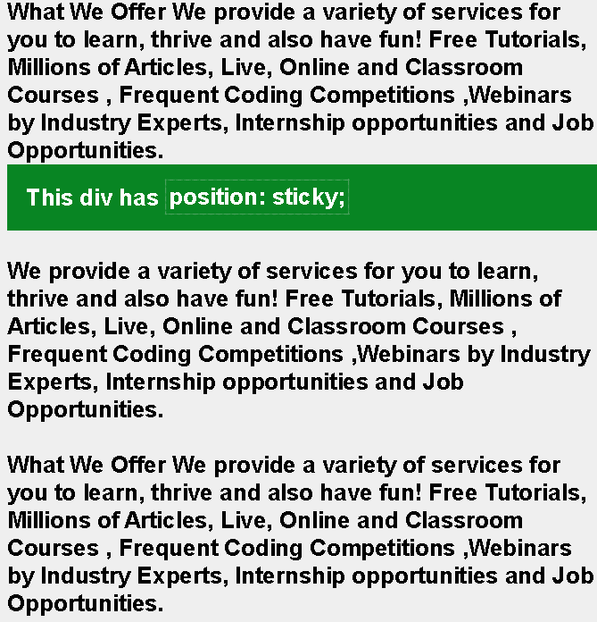

# CSS 中位置:粘性和位置:固定有什么区别？

> 原文:[https://www . geeksforgeeks . org/position-sticky 和 position-fixed-in-CSS 的区别是什么/](https://www.geeksforgeeks.org/what-is-the-difference-between-positionsticky-and-positionfixed-in-css/)

在本文中，我们将讨论两个非常相似的 CSS 属性，它们是*位置:粘性*和*位置:固定*。

CSS 中的[位置属性](https://www.geeksforgeeks.org/explain-the-positions-property-in-css/)指定了 HTML 元素或实体的位置。可以通过指定顶部、右侧、底部和左侧属性来设置元素的位置。这些参数指定了 HTML 元素与视口边缘的距离。要通过这四个属性设置位置，我们必须声明定位方法。CSS 中有五种定位属性:

*   **固定**:元素的位置将相对于视口定位。
*   **静态**:元素会按照页面的正常流程进行定位。
*   **相对**:该元素保留在文档的正常流程中，但会影响左、右、上、下。
*   **绝对**:元素的位置会相对于最近定位的祖先。
*   **粘性**:位置为*的元素:粘性*和*顶部:0* 根据放置的位置在固定的&相对之间起作用。

我们将只讨论位置:固定和粘性属性。这两者都用于将元素固定在 HTML 页面中的某个位置。详见 [CSS 定位元素](https://www.geeksforgeeks.org/css-positioning-elements/)一文。

**位置:固定**表示固定在视口。我们提供位置值(顶部、底部、右侧或左侧)，当用户滚动时，元素保持在那里。不管屏幕上发生了什么，固定元件都不会移动。

**语法:**

```css
selector {
     position: fixed;
}
```

**示例:**当我们使用**位置:固定**属性时，无论屏幕上发生什么，元素都保持固定在其位置，它在视口处是固定的。

## 超文本标记语言

```css
<html>
<head>
    <style>
    body {
        margin: 0;
        padding: 20px;
        font-family: sans-serif;
        background: #efefef;
    }

    .fixed {
        position: fixed;
        background: #088523;
        color: #ffffff;
        padding: 30px;
        top: 250;
        left: 10;
    }

    span {
        padding: 5px;
        border: 1px #ffffff dotted;
    }
    </style>
</head>

<body>
    <div class="fixed">This div has 
        <span>position: fixed;</span> 
    </div>
    <h1>
        What We Offer We provide a variety of 
        services for you to learn, thrive and 
        also have fun! Free Tutorials, Millions 
        of Articles, Live, Online and Classroom 
        Courses, Frequent Coding Competitions, 
        Webinars by Industry Experts, Internship 
        opportunities and Job Opportunities.
    <br/>
    <br/> 
        What We Offer We provide a variety of 
        services for you to learn, thrive and 
        also have fun! Free Tutorials, Millions 
        of Articles, Live, Online and Classroom 
        Courses, Frequent Coding Competitions, 
        Webinars by Industry Experts, Internship 
        opportunities and Job Opportunities.
    <br/>
    <br/> 
        What We Offer We provide a variety of 
        services for you to learn, thrive and 
        also have fun! Free Tutorials, Millions 
        of Articles, Live, Online and Classroom 
        Courses, Frequent Coding Competitions, 
        Webinars by Industry Experts, Internship 
        opportunities and Job Opportunities.
    <br/>
    <br/> 
        What We Offer We provide a variety of 
        services for you to learn, thrive and 
        also have fun! Free Tutorials, Millions 
        of Articles, Live, Online and Classroom 
        Courses, Frequent Coding Competitions, 
        Webinars by Industry Experts, Internship 
        opportunities and Job Opportunities.
    </h1> 
</body>
</html>
```

**输出:**


**位置:粘性**表示元素将滚动，直到达到用户给它的偏移值，然后停留在它的位置。粘性元素总是留在它的父块中，一旦父块作为滚动效果离开屏幕，粘性元素也随之离开。

**语法:**

```css
selector {
     position: sticky;
}
```

**示例:**当我们使用**位置:粘性**属性时，元素滚动到接触顶部，尽管进一步滚动，也会固定在该位置。

## 超文本标记语言

```css
<html>
<head>
    <style>
    body {
        margin: 0;
        padding: 20px;
        font-family: sans-serif;
        background: #efefef;
    }

    .sticky {
        position: sticky;
        background: #088523;
        color: #ffffff;
        padding: 30px;
        top: 0;
        left: 10;
    }

    span {
        padding: 5px;
        border: 1px #ffffff dotted;
    }
    </style>
</head>

<body>
    <h1>
       What We Offer We provide a variety of 
        services for you to learn, thrive and 
        also have fun! Free Tutorials, Millions 
        of Articles, Live, Online and Classroom 
        Courses, Frequent Coding Competitions, 
        Webinars by Industry Experts, Internship 
        opportunities and Job Opportunities.
    <br/>
    <div class="sticky">This div has 
        <span>position: sticky;</span>
    </div>
    <br/> 
        What We Offer We provide a variety of 
        services for you to learn, thrive and 
        also have fun! Free Tutorials, Millions 
        of Articles, Live, Online and Classroom 
        Courses, Frequent Coding Competitions, 
        Webinars by Industry Experts, Internship 
        opportunities and Job Opportunities.
    <br/>
    <br/> 
        What We Offer We provide a variety of 
        services for you to learn, thrive and 
        also have fun! Free Tutorials, Millions 
        of Articles, Live, Online and Classroom 
        Courses, Frequent Coding Competitions, 
        Webinars by Industry Experts, Internship 
        opportunities and Job Opportunities.
    <br/>
    <br/> 
        What We Offer We provide a variety of 
        services for you to learn, thrive and 
        also have fun! Free Tutorials, Millions 
        of Articles, Live, Online and Classroom 
        Courses, Frequent Coding Competitions, 
        Webinars by Industry Experts, Internship 
        opportunities and Job Opportunities.
    <br/>
    <br/> 
        What We Offer We provide a variety of 
        services for you to learn, thrive and 
        also have fun! Free Tutorials, Millions 
        of Articles, Live, Online and Classroom 
        Courses, Frequent Coding Competitions, 
        Webinars by Industry Experts, Internship 
        opportunities and Job Opportunities.
    </h1>
</body>
</html>
```

**输出:**



**位置的区别:固定与位置:粘属性:**

<figure class="table">

| 

#### s . no .

 | 

#### **Position: fix**

 | 

#### **Location: stick**

 |
| --- | --- | --- |
| 1。 | 位置为*的元素:固定*属性固定在视口中，无论滚动与否都不会移动。 | 位置为*的元素:粘性*属性可以滚动到用户提供的偏移值。 |
| 2。 | 带位置的元素:固定属性从不离开它被固定到的视口位置。 | 带有位置的元素:当其父元素滚出视口时，粘性属性离开视口。 |
| 3。 | 这个属性是所有浏览器都支持的。 | 这个属性只有所有现代浏览器才支持。 |
| 4。 | Elements with positions: Fixed attributes will not affect the flow of other elements on the page, that is, they will not occupy extra space. | Elements with positions: Sticky attributes do affect the flow of other elements in the page. , which takes up extra space. |

</figure>

**支持的浏览器:**

*位置:固定*由:

*   谷歌 Chrome 1.0
*   Internet Explorer 7.0
*   微软边缘 12.0
*   Firefox 1.0
*   Opera 4.0
*   Safari 1.0

*位置:粘性*由:

*   谷歌 Chrome 56.0
*   微软边缘 16.0
*   Firefox 32.0
*   Opera 43，0
*   Safari 13.0