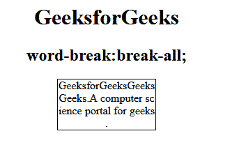
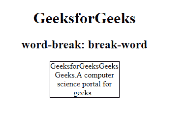
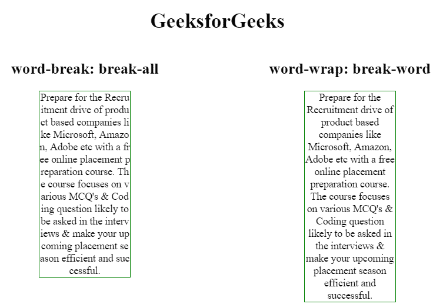

# CSS 中的“断字:断全”和“换行:断字”有什么区别？

> 原文:[https://www . geesforgeks . org/word-break-break-all 与 word-wrap-break-word-in-css 的区别是什么/](https://www.geeksforgeeks.org/what-is-the-difference-between-word-break-break-all-versus-word-wrap-break-word-in-css/)

CSS 中的断字属性用于指定当一个单词到达一行的末尾时应该如何断开或拆分。自动换行属性用于拆分/断开长单词，并将它们换行到下一行。

**区别“断字:断全；”和“自动换行:断字；”**

*   **断字:断全；**用于任意字符断字，防止溢出。
*   **换行:断字；**用于任意点断字，防止溢出。

“断字:断所有；会在任何字符处断字，因此结果是阅读困难，而“自动换行:断字将拆分单词而不使单词在中间断开，并将其换行到下一行。

**示例 1:** 本示例显示了全部中断属性值。

```css
<!DOCTYPE html> 
<html> 
    <head> 
        <style> 
            p { 
                width: 142px; 
                border: 1px solid #000000; 
            } 

            p.gfg { 
                word-break: break-all; 
            } 
        </style> 
    </head> 
    <body> 
        <center> 
            <h1 style="color:green;">GeeksforGeeks</h1> 
            <h2>word-break: break-all;</h2> 
            <p class="gfg">GeeksforGeeksGeeksGeeks. A 
            computer science portal for geeks .</p> 
        </center> 
    </body> 
</html> 
```

**输出:**


**示例 2:** 本示例显示断字属性值。

```css
<!DOCTYPE html> 
<html> 
    <head> 
        <style> 
            p { 
                width: 140px; 
                border: 1px solid #000000; 
                color:black; 
            } 
            p.gfg { 
                word-break: break-word; 
            } 
        </style> 
    </head> 
    <body> 
        <center> 
            <h1>GeeksforGeeks</h1> 
            <h2>word-break: break-word</h2> 
            <p class="gfg">GeeksforGeeksGeeksGeeks.A 
            computer science portal for geeks .</p> 
        </center> 
    </body> 
</html> 
```

**输出:**


**示例 3:** 本示例显示了全断和断字属性值的比较。

```css
<!DOCTYPE html>
<html>

<head>

    <!-- style to set word-break property -->
    <style>
        .wb {
            word-break: break-all;
            width: 140px; 
            border: 1px solid green;
        }
        .wr {
            word-wrap: break-word;
            width: 140px; 
            border: 1px solid green;
        }
        .main1 {
            width:50%;
            float:left;
        }
        .main2 {
            width:50%;
            float:left;
        }
    </style>
</head>

<body>
    <center>
        <h1>GeeksforGeeks</h1>

        <div style = "width:100%;">

            <div class = "main1">
                <h2>word-break: break-all:</h2>

                <div class="wb">
                    Prepare for the Recruitment drive of product
                    based companies like Microsoft, Amazon, Adobe
                    etc with a free online placement preparation
                    course. The course focuses on various MCQ's
                    & Coding question likely to be asked in the
                    interviews & make your upcoming placement
                    season efficient and successful.
                </div>
            </div>

            <div class = "main2">
                <h2>word-wrap: break-word:</h2>

                <div class="wr">
                    Prepare for the Recruitment drive of product
                    based companies like Microsoft, Amazon, Adobe
                    etc with a free online placement preparation
                    course. The course focuses on various MCQ's
                    & Coding question likely to be asked in the
                    interviews & make your upcoming placement
                    season efficient and successful.
                </div>
            </div>
        </div>
    </center>
</body>

</html>                    
```

**输出:**
