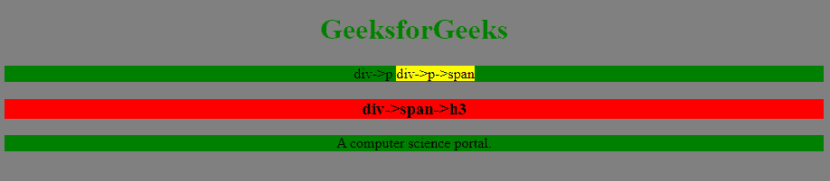

# 在 CSS 中星号(*)选择器有什么用？

> 原文:[https://www . geeksforgeeks . org/CSS 中的星号选择器有什么用处/](https://www.geeksforgeeks.org/what-is-the-use-of-asterisk-selector-in-css/)

星号(*)被称为 **CSS 通用选择器**。它可以用来选择 HTML 页面中的任何和所有类型的元素。使用选择子对象时，星号后面还可以跟一个选择器。当我们想要选择页面上的所有元素时，这个选择器非常有用。
例如:

```html
* {
    property : value;
 }
```

在选择元素时，如果我们只使用星号(*)，那么 HTML 页面的所有元素都会被选中，而不管父子关系如何。如果我们在选择特定父代的子代时使用星号(*)，那么我们可以通过以下方式选择该父代的所有子代:

```html
parent * {
           property : value;
 }
```

我们可以使用星号(*)作为中间级别，同时通过以下方式选择元素:

```html
grand_parent * grand_child{
           property : value;
 }
```

**示例:**

```html
Input:  * { color : green; }
Output:  The text in all the elements become green

Input:  * p { color : green; }
Output:  The text inside those  which are direct children of any elements of HTML the page will become green.
```

## 超文本标记语言

```html
<!DOCTYPE html>
<html>

<head>
    <style>
        * {
            background-color: gray;
        }

        * p {
            background-color: green;
        }

        * p span {
            background-color: yellow;
        }

        div * h3 {
            background-color: red;
        }
    </style>
</head>

<body>
    <center>
        <h1 style="color:green">
          GeeksforGeeks
      </h1>

        <div>

<p>
                div->p
                <span> div->p->span </span>
            </p>

            <span>
    <h3> div->span->h3</h3>
</span>
        </div>

<p>A computer science portal.</p>

    </center>
</body>

</html>
```

**输出:**



**支持的浏览器:**

*   谷歌 Chrome 4.0
*   Internet Explorer 7.0
*   Firefox 2.0
*   歌剧 9.6
*   Safari 3.1