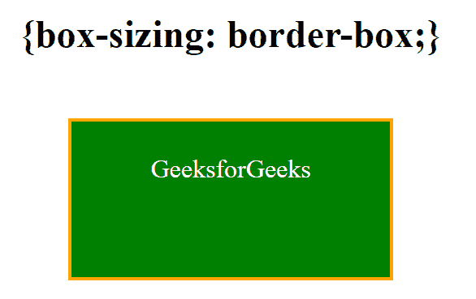
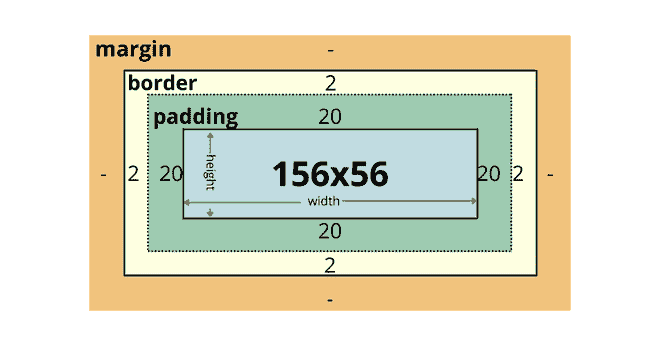

# CSS 中的大小写属性有什么用？

> 原文:[https://www . geeksforgeeks . org/CSS 中的盒子大小属性的用途是什么/](https://www.geeksforgeeks.org/what-is-the-use-of-box-sizing-property-in-css/)

**框大小**属性定义了元素的宽度和高度如何对用户可见，即是否包括边框和填充。

**语法:**

```css
box-sizing: content-box|border-box;
```

**属性值:**

*   **内容框** ( *默认*值)
*   **边框:**它告诉浏览器，为元素的宽度和高度指定的值将包括内容、填充和边框。这通常会使元素的大小调整变得更加容易。边框尺寸:边框是浏览器用于<表格>、<选择>和<按钮>元素的默认样式。例如–如果您将元素的宽度设置为 200，高度设置为 100 像素，则 200 和 100 像素将包括您添加的任何边框或填充，并且内容框将收缩以吸收额外的宽度和高度。

**语法:**

```css
box-sizing: border-box;
```

元素的尺寸计算如下:

```css
width = border + padding + width of the content  
height = border + padding + height of the content
```

**示例:**

## 超文本标记语言

```css
<!DOCTYPE html>
<html>

<head>
    <title>box-sizing Property</title>

    <style>
        div {
            width: 200px;
            height: 100px;
            padding: 20px;
            border: 2px solid orange;
            background: green;
            color: white;
            display: inline-block
        }

        .box {
            box-sizing: border-box;
        }
    </style>
</head>

<body style="text-align:center;">
    <h2>{box-sizing: border-box;}</h2>
    <br>
    <div class="box">GeeksforGeeks</div>
</body>

</html>
```

**输出:**



下图说明了上述示例的**{框尺寸:边框:}** 。



**浏览器支持:****浏览器完全支持框大小属性，如下所示–**

*   **Google Chrome 10.0 4.0 -webkit-**
*   **Internet Explorer 8.0**
*   **火狐 29.0 2.0 -moz-**
*   **歌剧 9.5**
*   **Apple Safari 5.1 3.2 -webkit-**