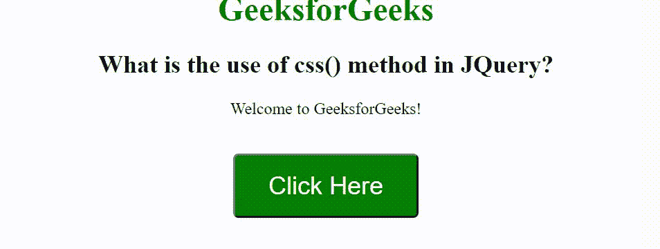

# CSS()方法在 jQuery 中有什么用？

> 原文:[https://www . geeksforgeeks . org/什么是 CSS-in-jquery-method/](https://www.geeksforgeeks.org/what-is-the-use-of-css-method-in-jquery/)

在本文中，我们将看到如何使用 [css()方法](https://www.geeksforgeeks.org/jquery-css-method/)使用 jQuery 动态设置元素上的样式。css()方法用于更改选定元素的样式属性。

**语法:**

```html
$(selector).css(property)
```

**方法:**这里，我们添加了一个段落元素和一个按钮，点击按钮后，调用 css()方法，该方法将 CSS 样式应用到段落元素上。

**示例:**

## 超文本标记语言

```html
<!DOCTYPE html>
<html>

<head>
    <title>
        What is the use of css() method in JQuery?
    </title>

    <script src=
"https://ajax.googleapis.com/ajax/libs/jquery/3.5.1/jquery.min.js">
    </script>

    <style>
        body {
            text-align: center;
        }

        button {
            background-color: green;
            color: white;
            font-size: 24px;
            border-radius: 5px;
            padding: 15px 32px;
            text-align: center;
            text-decoration: none;
        }
    </style>

    <script>
        $(document).ready(function() {
            $("button").click(function() {
                $("#GFG").css({
                    color: "white",
                    background: "green",
                    fontSize: "25px",
                    display: "table",
                    margin: "0px auto 0px auto"
                });
            });
        });
    </script>
</head>

<body>
    <h1 style="color:green">
        GeeksforGeeks
    </h1>

    <h2>
        What is the use of css() method in JQuery?
    </h2>

    <p id="GFG">
        Welcome to GeeksforGeeks!
    </p>

    <br>

    <button>
        Click Here
    </button>
</body>

</html>
```

**输出:**

