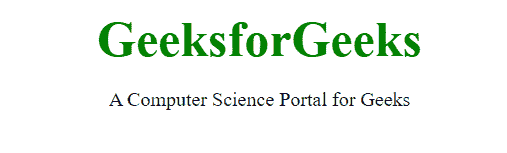

# CSS 规则集有什么用？

> 原文:[https://www . geesforgeks . org/CSS-ruleset/](https://www.geeksforgeeks.org/what-is-the-use-of-css-ruleset/)的用途是什么

在本文中，我们将了解 CSS 规则集及其实现。CSS 规则集是对文档各部分或元素的各种确认。目标是在连接的 HTML 页面中，为某个单独的组件或组件的特定排列应用一组属性。它提供了声明*键:值*对属性的方法，该属性具有定义的结构，用于以适当的方式组织网页中的内容。例如，考虑以下示例:

```html
.container {
    padding: 10 px;
}
```

这是为容器类应用值为 10px 的填充的基本 CSS 属性。为了理解这一点，我们将分解每个组件。

*   完整的声明是一个规则集。
*   *。容器*是一个选择器。选择器有两种类型，即由哈希(#)表示的 **id** 选择器，用于应用具有唯一 id 的属性。第二个是**类**选择器，用点(。)，用于选择属于特定类属性的所有元素。
*   中间用冒号分隔的键/值对是一个*声明，以分号结束。*
*   键为*属性名* &值为*属性值，*键和值在 CSS 中默认不区分大小写。
*   花括号和属性被声明的部分是*声明块*。

CSS 规则集用于应用一组属性，这些属性为元素或 HTML 页面中使用的一组特定元素定义了一些值。请参考[什么是 CSS 规则集？](https://www.geeksforgeeks.org/what-is-css-ruleset/)文章获取更多详情。

让我们通过示例来详细了解规则集。

**示例 1:** 该示例以适当的方式说明了 CSS 规则集的使用。

## 超文本标记语言

```html
<!DOCTYPE html>
<html>
  <head>
    <style>
      h1 {
        color: green;
      }

      /* Selector */
      span {

        /* Declaration-block */
        background-color: purple;
        color: white;
        padding: 5px;
        font-size: 15px;
        border-radius: 50px;
      }

      .divClass {
        font-family: Sans-serif;
      }

      body {
        text-align: center;
      }
    </style>
  </head>

  <body>
    <div class="divClass">
      <h1>GeeksforGeeks</h1>
      <span>A Computer Science portal for Geeks</span>
    </div>
  </body>
</html>
```

**解释:**我们已经为声明的 HTML 元素应用了所有必需的属性。我们使用了类选择器，它用于选择属于特定类属性的所有元素。

**输出:**


**示例 2:** 在本例中，我们使用了一个 id 选择器，用于应用具有唯一 id 的属性。

## 超文本标记语言

```html
<!DOCTYPE html>
<html>
  <head>

    <!--Style of class selector -->
    <style>
      #heading {
        color: green;
        font-size: 40px;
        font-weight: bold;
      }
      body {
        text-align: center;
      }
    </style>
  </head>

  <body>
    <div id="heading">GeeksforGeeks</div>
    <p>A Computer Science Portal for Geeks</p>
  </body>
</html>
```

**输出:**

