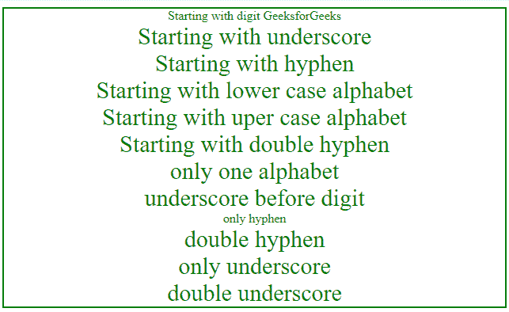
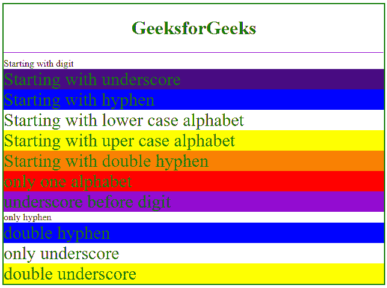

# CSS 类名/选择器中哪些字符有效？

> 原文:[https://www . geesforgeks . org/哪些字符是有效的 css 类名称选择器/](https://www.geeksforgeeks.org/which-characters-are-valid-in-css-class-names-selectors/)

在 CSS 中选择一个有效的类名或选择器是非常容易的，只要遵循规则。

*   有效的名称应该以下划线(_)、连字符(-)或字母(a-z)/(A-Z)开头，后跟任何数字、连字符、下划线和字母。
*   不能以数字开头，以数字开头 HTML5 可以接受，CSS 不可以接受。
*   两个连字符后跟一个数字是有效的。

**示例 1:** 本示例使用 CSS 描述了有效 id 选择器的列表。

## 超文本标记语言

```html
<!DOCTYPE html>
<html>

<head>
    <title>
        Valid id Selectors
    </title>

    <style>
        #main {
            border:2px solid green;
            text-align:center;
        }
        #1st {
            color:green;
            font-size:30px;
        }
        #_st {
            color:green;
            font-size:30px;
        }
        #-st {
            color:green;
            font-size:30px;
        }
        #st {
            color:green;
            font-size:30px;
        }
        #St {
            color:green;
            font-size:30px;
        }
        #--1 {
            color:green;
            font-size:30px;
        }
        #s {
            color:green;
            font-size:30px;
        }
        #_1 {
            color:green;
            font-size:30px;
        }
        #- {
            color:green;
            font-size:30px;
        }
        #-- {
            color:green;
            font-size:30px;
        }
        #_ {
            color:green;
            font-size:30px;
        }
        #__ {
            color:green;
            font-size:30px;
        }
    </style>
</head>

<body>
    <div id="main">
        <div id="1st">Starting with digit GeeksforGeeks</div>
        <div id="_st">Starting with underscore</div>
        <div id="-st">Starting with hyphen</div>
        <div id="st">Starting with lower case alphabet</div>
        <div id="St">Starting with upper case alphabet</div>
        <div id="--1">Starting with double hyphen</div>
        <div id="s">only one alphabet</div>
        <div id="_1">underscore before digit</div>
        <div id="-">only hyphen</div>
        <div id="--">double hyphen</div>
        <div id="_">only underscore</div>
        <div id="__">double underscore</div>
    </div>
</body>

</html>
```

**输出:**



**示例 2:** 本示例使用 CSS 描述了有效类选择器的列表。

## 超文本标记语言

```html
<!DOCTYPE html>
<html>

<head>
    <style>
        .main {
            border:2px solid green;
        }
        .1st {
            color:green;
            font-size:30px;
            background-color:#9400D3;
        }
        ._st {
            color:green;
            font-size:30px;
            background-color:#4B0082;
        }
        .-st {
            color:green;
            font-size:30px;
            background-color:#0000FF;
        }
        .st {
            color:green;
            font-size:30px;
            background-color:##00FF00;
        }
        .St {
            color:green;
            font-size:30px;
            background-color:#FFFF00;
        }
        .--1st {
            color:green;
            font-size:30px;
            background-color:#FF7F00;
        }
        .s {
            color:green;
            font-size:30px;
            background-color:#FF0000;
        }
        ._1 {
            color:green;
            font-size:30px;
            background-color:#9400D3;
        }
        .- {
            color:green;
            font-size:30px;
            background-color:#4B0082;
        }
        .-- {
            color:green;
            font-size:30px;
            background-color:#0000FF;
        }
        ._ {
            color:green;
            font-size:30px;
            background-color:##00FF00;
        }
        .__{
            color:green;
            font-size:30px;
            background-color:#FFFF00;
        }

    </style>
</head>

<body>
    <div class="main">
        <h1 style="color:green; text-align:center;">
            GeeksforGeeks
        </h1>

        <hr>

        <div class="1st">Starting with digit </div>
        <div class="_st">Starting with underscore</div>
        <div class="-st">Starting with hyphen</div>
        <div class="st">Starting with lower case alphabet</div>
        <div class="St">Starting with upper case alphabet</div>
        <div class="--1st">Starting with double hyphen</div>
        <div class="s">only one alphabet</div>
        <div class="_1">underscore before digit</div>
        <div class="-">only hyphen</div>
        <div class="--">double hyphen</div>
        <div class="_">only underscore</div>
        <div class="__">double underscore</div>
    </div>
</body>

</html>                                 
```

**输出:**

