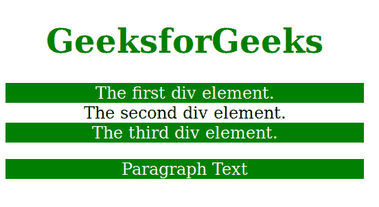
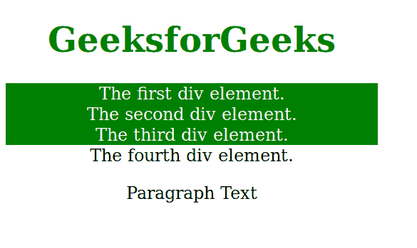

# 类 CSS 中的通配符选择器(*、^和$)

> 原文:[https://www . geesforgeks . org/通配符-选择器-和-in-CSS-for-class/](https://www.geeksforgeeks.org/wildcard-selectors-and-in-css-for-classes/)

通配符选择器用于同时选择多个元素。它选择相似类型的类名或属性，并使用 CSS 属性。*通配符也称为包含通配符。

**【属性*=“字符串”】选择器:**【属性*=“字符串”】选择器用于选择属性值包含指定子字符串*字符串*元素。这个例子展示了如何使用一个通配符来选择一个包含*字符串*的类的所有 div。这可能是在课程的开始、结束或中途。
**语法:**

```html
[attribute*="value"] {
    // CSS property
}
```

**示例:**

```html
<!DOCTYPE html>
<html>
    <head>
        <style> 

            /* Define styles of selected items, h1 and
               rest of the body */
            [class*="str"] {  /* WE USE * HERE */
                background: green;
                color: white;
            }
            h1 {
                color:green;
            }
            body {
                text-align:center;
                width:60%;
            }
        </style>
    </head>
    <body>
        <h1>GeeksforGeeks</h1>

        <!-- Since we have used * with str, all items with
             str in them are selected -->
        <div class="first_str">The first div element.</div>
        <div class="second">The second div element.</div>
        <div class="my-strt">The third div element.</div>
        <p class="mystr">Paragraph Text</p>
    </body>
</html>
```

**输出:**


**【attribute^="str "】选择器:**【attribute^="value "】选择器用于选择属性值以指定值 *str* 开头的元素。此示例显示了如何使用通配符选择以*字符串*开头的类的所有 div。

**语法:**

```html
[attribute^="str"] {
    // CSS property
}
```

**示例:**

```html
<!DOCTYPE html>
<html>
    <head>
        <style> 
            [class^="str"] { /*WE USE ^ HERE */
                background: green;
                color: white;
            }
            h1 {
                color:green;
            }
            body {
                text-align:center;
                width:60%;
            }
        </style>
    </head>
    <body>
        <h1>GeeksforGeeks</h1>

        <!-- All items beginning with str are highlighted -->
        <div class="strfirst">The first div element.</div>
        <div class="strsecond">The second div element.</div>
        <div class="str-start">The third div element.</div>
        <div class="end-str">The fourth div element.</div>
        <p class="my">Paragraph Text</p>
    </body>
</html>
```

**输出:**


**【属性$=“str”】选择器:**【属性$ =“值”】选择器用于选择那些属性值以指定值 *str* 结束的元素。以下示例选择类属性值以*字符串*结尾的所有元素。

**语法:**

```html
[attribute$="str"] {
    // CSS property
}
```

**示例:**

```html
<!DOCTYPE html>
<html>
    <head>
        <style> 
            [class$="str"] { /* WE USE $ HERE */
                background: green;
                color: white;
            }
            h1 {
                color:green;
            }
            body {
                text-align:center;
                width:60%;
            }
        </style>
    </head>
    <body>
        <h1>GeeksforGeeks</h1>

        <!-- All items ending with str are highlighted -->
        <div class="firststr">The first div element.</div>
        <div class="stsecondstr">The second div element.</div>
        <div class="start">The third div element.</div>
        <p class="mystr">This is some text in a paragraph.</p>
    </body>
</html>                                 
```

**输出:**


HTML 是网页的基础，通过构建网站和网络应用程序用于网页开发。您可以通过以下 [HTML 教程](https://www.geeksforgeeks.org/html-tutorials/)和 [HTML 示例](https://www.geeksforgeeks.org/html-examples/)从头开始学习 HTML。

CSS 是网页的基础，通过设计网站和网络应用程序用于网页开发。你可以通过以下 [CSS 教程](https://www.geeksforgeeks.org/css-tutorials/)和 [CSS 示例](https://www.geeksforgeeks.org/css-examples/)从头开始学习 CSS。