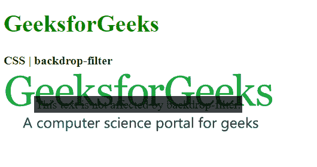
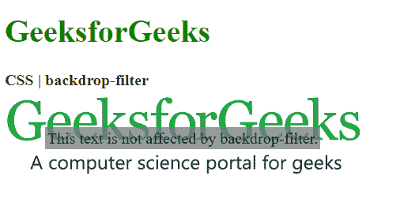
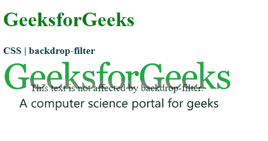
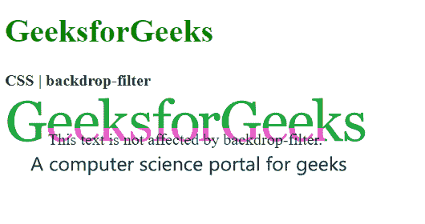
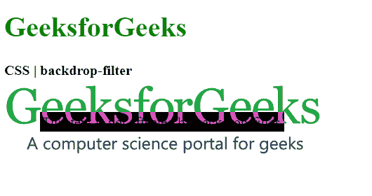
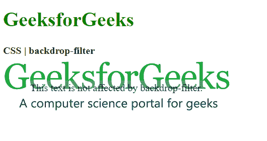
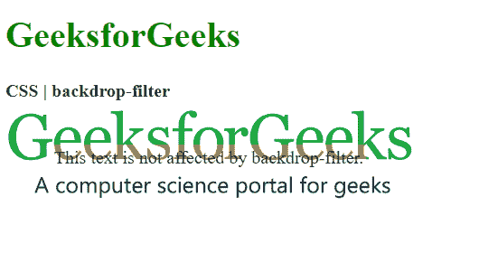

# CSS 中背景过滤的变通方法

> 原文:[https://www . geesforgeks . org/变通方法-背景-过滤-in-css/](https://www.geeksforgeeks.org/workaround-to-backdrop-filter-in-css/)

[CSS 背景滤镜属性](https://www.geeksforgeeks.org/css-backdrop-filter-property/)用于对元素后面的区域应用效果。这与滤镜属性不同，滤镜属性将效果应用于整个元素。它可以用来消除使用额外的元素来单独设置背景的样式。

**语法:**

```css
.element {
  backdrop-filter: filter-function | none
}

```

**方法:**
在图像(和视频)上创建覆盖通常需要使用某种阴影效果。例如，使用白色图标要求阴影在接近白色的背景下可见。使用背景滤镜，您可以创建适应背景颜色的覆盖，而不是使用阴影。

**可以有很多过滤功能:**

1.  **模糊()**–用于对图像应用高斯模糊。
    T3】例:

```css
<!DOCTYPE html> 
<html> 

<head> 
    <style> 
        .container { 
            background-image: url( 
"https://media.geeksforgeeks.org/wp-content/uploads/geeksforgeeks-25.png"); 
            background-size: cover;  
            align-items: center; 
            justify-content: center; 
            height: 100px; 
            width: 250px; 
        } 
        .foreground { 
            backdrop-filter: blur(2px); 
            padding: 2px; 
        } 
    </style> 
</head> 

<body> 
    <h1 style="color: green"> 
        GeeksforGeeks 
    </h1> 

    <b>CSS | backdrop-filter</b> 

    <div class="container"> 
        <div class="foreground"> 
            This text is not affected 
            by backdrop-filter. 
        </div> 
    </div> 
</body> 
</html> 
```

输出:


*   **brightness():** It is used to make the image lighter or darker (0% – darker and 100% – brighter ).

    ```css
    <!DOCTYPE html> 
    <html> 

    <head> 

        <style> 
            .container { 
                background-image: url( 
    "https://media.geeksforgeeks.org/wp-content/uploads/geeksforgeeks-25.png"); 
                background-size: cover; 
                display: flex; 
                align-items: center; 
                justify-content: center; 
                height: 100px; 
                width: 360px;     
            } 
            .foreground { 
                backdrop-filter: brightness(25%); 
                padding: 2px; 
            } 
        </style> 
    </head> 

    <body> 
        <h1 style="color: green"> 
            GeeksforGeeks 
        </h1> 

        <b>CSS | backdrop-filter</b> 

        <div class="container"> 
            <div class="foreground"> 
                This text is not affected 
                by backdrop-filter. 
            </div> 
        </div> 
    </body> 

    </html> 

    ```

    输出:
    

    *   **contrast()** – It is used to set the contrast of the image (100% – original and 0% darker)

    ```css
    <!DOCTYPE html> 
    <html> 

    <head> 
        <style> 
            .container { 
                background-image: url( 
    "https://media.geeksforgeeks.org/wp-content/uploads/geeksforgeeks-25.png"); 
                background-size: cover; 
                display: flex; 
                align-items: center; 
                justify-content: center; 
                height: 100px; 
                width: 360px;     
            } 
            .foreground { 
                backdrop-filter: contrast(20%); 
                padding: 2px; 
            } 
        </style> 
    </head> 

    <body> 
        <h1 style="color: green"> 
            GeeksforGeeks 
        </h1> 

        <b>CSS | backdrop-filter</b> 

        <div class="container"> 
            <div class="foreground"> 
                This text is not affected by 
                backdrop-filter. 
            </div> 
        </div> 
    </body> 

    </html> 
    ```

    输出:
    

    *   **drop-shadow()** – It is used to apply a drop shadow effect to the element.

    ```css
    <!DOCTYPE html> 
    <html> 

    <head>

        <style> 
            .container { 
                background-image: url( 
    "https://media.geeksforgeeks.org/wp-content/uploads/geeksforgeeks-25.png"); 
                background-size: cover; 
                display: flex; 
                align-items: center; 
                justify-content: center; 
                height: 100px; 
                width: 360px;     
            } 
            .foreground { 
                backdrop-filter: drop-shadow(20px 10px red); 
                padding: 2px; 
            } 
        </style> 
    </head> 

    <body> 
        <h1 style="color: green"> 
            GeeksforGeeks 
        </h1> 

        <b>CSS | backdrop-filter</b> 

        <div class="container"> 
            <div class="foreground"> 
                This text is not affected by 
                backdrop-filter. 
            </div> 
        </div> 
    </body> 

    </html> 
    ```

    输出:
    

    *   **grayscale()** – It is used to convert the colors of the image into black and white. A value of 0% indicates the original image and 100% will indicate a completely black and white image.

    ```css
    <!DOCTYPE html> 
    <html> 

    <head> 

        <style> 
            .container { 
                background-image: url( 
    "https://media.geeksforgeeks.org/wp-content/uploads/geeksforgeeks-25.png"); 
                background-size: cover; 
                display: flex; 
                align-items: center; 
                justify-content: center; 
                height: 100px; 
                width: 360px;     
            } 
            .foreground { 
                backdrop-filter: grayscale(75%); 
                padding: 2px; 
            } 
        </style> 
    </head> 

    <body> 
        <h1 style="color: green"> 
            GeeksforGeeks 
        </h1> 

        <b>CSS | backdrop-filter</b> 

        <div class="container"> 
            <div class="foreground"> 
                This text is not affected by 
                backdrop-filter. 
            </div> 
        </div> 
    </body> 

    </html> 
    ```

    输出:
    

    *   **hue-rotate()** – It is used to apply a hue rotation to the image.

    ```css
    <!DOCTYPE html> 
    <html> 

    <head> 

        <style> 
            .container { 
                background-image: url( 
    "https://media.geeksforgeeks.org/wp-content/uploads/geeksforgeeks-25.png"); 
                background-size: cover; 
                display: flex; 
                align-items: center; 
                justify-content: center; 
                height: 100px; 
                width: 360px;     
            } 
            .foreground { 
                backdrop-filter: hue-rotate(180deg); 
                padding: 2px; 
            } 
        </style> 
    </head> 

    <body> 
        <h1 style="color: green"> 
            GeeksforGeeks 
        </h1> 

        <b>CSS | backdrop-filter</b> 

        <div class="container"> 
            <div class="foreground"> 
                This text is not affected by 
                backdrop-filter. 
            </div> 
        </div> 
    </body> 

    </html> 
    ```

    输出:
    

    *   **invert()** – It is used to invert the image. The default value is 0% which represents the original image.

    ```css
    <!DOCTYPE html> 
    <html> 

    <head>

        <style> 
            .container { 
                background-image: url( 
    "https://media.geeksforgeeks.org/wp-content/uploads/geeksforgeeks-25.png"); 
                background-size: cover; 
                display: flex; 
                align-items: center; 
                justify-content: center; 
                height: 100px; 
                width: 360px;     
            } 
            .foreground { 
                backdrop-filter: invert(100%); 
                padding: 2px; 
            } 
        </style> 
    </head> 

    <body> 
        <h1 style="color: green"> 
            GeeksforGeeks 
        </h1> 

        <b>CSS | backdrop-filter</b> 

        <div class="container"> 
            <div class="foreground"> 
                This text is not affected by 
                backdrop-filter. 
            </div> 
        </div> 
    </body> 

    </html> 
    ```

    输出:
    

    *   **opacity()** – It is used to set the opacity of the image. The default value is 0% which indicates that the image is completely transparent.

    ```css
    <!DOCTYPE html> 
    <html> 

    <head> 

        <style> 
            .container { 
                background-image: url( 
    "https://media.geeksforgeeks.org/wp-content/uploads/geeksforgeeks-25.png"); 
                background-size: cover; 
                display: flex; 
                align-items: center; 
                justify-content: center; 
                height: 100px; 
                width: 360px;     
            } 
            .foreground { 
                backdrop-filter: opacity(50%); 
                padding: 2px; 
            } 
        </style> 
    </head> 

    <body> 
        <h1 style="color: green"> 
            GeeksforGeeks 
        </h1> 

        <b>CSS | backdrop-filter</b> 

        <div class="container"> 
            <div class="foreground"> 
                This text is not affected by 
                backdrop-filter. 
            </div> 
        </div> 
    </body> 

    </html> 
    ```

    输出:
    

    *   **saturate()** – It is used to set the saturation of the element. The default value is 100% which indicates the original image.

    ```css
    <!DOCTYPE html> 
    <html> 

    <head> 

        <style> 
            .container { 
                background-image: url( 
    "https://media.geeksforgeeks.org/wp-content/uploads/geeksforgeeks-25.png"); 
                background-size: cover; 
                display: flex; 
                align-items: center; 
                justify-content: center; 
                height: 100px; 
                width: 360px;     
            } 
            .foreground { 
                backdrop-filter: saturate(50%); 
                padding: 2px; 
            } 
        </style> 
    </head> 

    <body> 
        <h1 style="color: green"> 
            GeeksforGeeks 
        </h1> 

        <b>CSS | backdrop-filter</b> 

        <div class="container"> 
            <div class="foreground"> 
                This text is not affected by 
                backdrop-filter. 
            </div> 
        </div> 
    </body> 

    </html> 
    ```

    输出:
    

    *   **sepia()** – It is used to convert the image to sepia giving it a warmer appearance. A 0% value represents the original image and 100% represents a completely sepia image.

    ```css
    <!DOCTYPE html> 
    <html> 

    <head> 

        <style> 
            .container { 
                background-image: url( 
    "https://media.geeksforgeeks.org/wp-content/uploads/geeksforgeeks-25.png"); 
                background-size: cover; 
                display: flex; 
                justify-content: center; 
                height: 100px; 
                width: 360px;     
            } 
            .foreground { 
                backdrop-filter: sepia(100%); 
                padding: 2px; 
            } 
        </style> 
    </head> 

    <body> 
        <h1 style="color: green"> 
            GeeksforGeeks 
        </h1> 

        <b>CSS | backdrop-filter</b> 

        <div class="container"> 
            <div class="foreground"> 
                This text is not affected by 
                backdrop-filter. 
            </div> 
        </div> 
    </body> 

    </html> 
    ```

    输出:
    