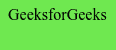

# 使用 SASS

将 Hex 转换为 RGBa 以获得背景不透明度

> 原文:[https://www . geesforgeks . org/convert-hex-to-rgba-for-background-opacity-using-sass/](https://www.geeksforgeeks.org/convert-hex-to-rgba-for-background-opacity-using-sass/)

[Sass rgba 函数](https://www.geeksforgeeks.org/sass-color-functions/)使用红绿蓝阿尔法模型来描述颜色，其中阿尔法用于增加颜色的不透明度。它的值介于 0.0(完全透明)到 1.0(完全不透明)之间。该函数接受两个输入值——十六进制颜色代码和字母，并将十六进制代码转换为 RGBa 格式。

**语法:**

*   使用背景色属性:

    ```html
    element {
        background-color: rgba(hex_value, opacity_value);
    }
    ```

*   使用[混合](https://www.geeksforgeeks.org/sass-mixin-and-include/)的背景色属性，提供十六进制回退:

    ```html
    @mixin background-opacity($color, $opacity) {
        background: $color;  /*Fallback */
        background: rgba($color, $opacity);
    }

    body {
         @include background-opacity(hex_value, opacity_value);
    }
    ```

以下示例说明了上述方法:

**示例 1:** 给十六进制代码添加 70%的不透明度

```html
<!DOCTYPE html>
<html>
<head>
<title>Converting Hex to RGBA for background opacity</title>
</head>
<body>
  <p>GeeksforGeeks</p>
</body>
</html>
```

*   **SASS 代码:**

    ```html
    @mixin background-opacity($color, $opacity) {
        background: $color;
        background: rgba($color, $opacity);
    }

    body {
         @include background-opacity(#32DF07, 0.7);
    }
    ```

*   **转换后的 CSS 代码:**

    ```html
    body {
      background: #32DF07;
      background: rgba(50, 223, 7, 0.7);
    }
    ```

**输出:**


**示例 2:** 给十六进制代码添加 50%的不透明度

```html
<!DOCTYPE html>
    <html>
     <head>
       <title>
Converting Hex to RGBA for background opacity
       </title>
     </head>
<body>
  <p>GeeksforGeeks</p>
</body>
</html>
```

*   **SASS 代码:**

    ```html
    @mixin background-opacity($color, $opacity) {
        background: $color;
        background: rgba($color, $opacity);
    }

    body {
         @include background-opacity(#32DF07, 0.5);
    }
    ```

*   **转换后的 CSS 代码:**

    ```html
    body {
      background: #32DF07;
      background: rgba(50, 223, 7, 0.5);
    }
    ```

**输出:**
