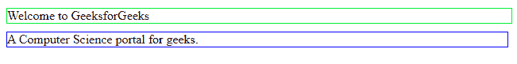
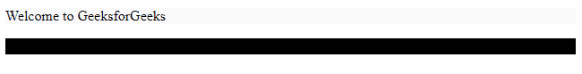

# 解释如何在 SASS

中定义变量

> 原文:[https://www . geesforgeks . org/explain-how-define-a-variable-in-sass/](https://www.geeksforgeeks.org/explain-how-to-define-a-variable-in-sass/)

[SASS](https://www.geeksforgeeks.org/sass-introduction/) 是语法上很棒的样式表的简称，是层叠样式表(CSS)的扩展。它是 CSS 的预处理器。它被编译成 CSS &完全兼容 CSS 的每个版本。Sass 减少了 CSS 的重复，因此节省了时间。它允许使用变量、嵌套规则、混合、函数等等，所有这些都具有完全兼容 CSS 的语法。它有助于以组织良好的方式组织复杂的&大型结构化样式表&，从而促进代码的可重用性。这是一个开源的免费使用扩展，由汉普顿·卡特林设计，由娜塔莉·韦森鲍姆和克里斯·埃普斯坦在 2006 年开发。

Sass 引入了 CSS 中不存在的几个特性，比如可以用来存储数据或信息的变量，这些数据或信息可以在以后使用。这是萨斯的一个重要特征。在本文中，我们将学习如何在 Sass 中定义一个变量&将通过示例了解它的实现。

**萨斯变量:**

*   Sass 变量声明一次，以存储需要时可以重用的数据。
*   如果修改变量值一次，则无论何时使用变量，更改都会反映在所有地方。
*   在 Sass 中，我们可以以多种类型存储数据，如数字、字符串、布尔值、列表、空值等。
*   Sass 使用美元符号($)来声明一个变量，后跟指定的变量名和用冒号(:)分隔的变量值。该行必须以分号(；).变量也可以与其他值一起使用。
*   您也可以使用下划线(_)或连字符(–)来声明描述性变量名。
*   我们可以通过对变量执行多次数学运算来提高 Sass 的效率。

**语法:**

```
$var_Name : var-value;
```

**示例:**下面的示例将演示如何在 SASS 中定义变量。

**文件名** ***:** 样式*

```
// Global variable declaration
$global__light: #f9f9f9;
$global__dark: #000;
$global__font: ("Poppins");
$global__f_size: 26;
$global__Max_width: 1280px;

div {
  $local__green: #00f034;

  // Global variable called
  color: $global__dark;
  border: 1px solid $local__green;
  font: $global__font;

  // Global variable called
  max-width: $global__Max_width;
}

$global_sky: #0000ff;

p {

  // Local variable declare
  $local__margin: 10px 5px 20px 0;
  color: $global__dark;
  border: 1px solid $global_sky;
  font-size: $global__f_size;

  // Local variable called
  margin: $local__margin;
}
```

**输出:**生成的 CSS 输出将是:

**文件名:** *样式*

```
div {

  /* Global variable called */
  color: #000;
  border: 1px solid #00f034;
  font-family: "Poppins";

  /* Global variable called */
  max-width: 1280px;
}

p {
  color: #000;
  border: 1px solid #0000ff;
  font-size: 26;

  /* Local variable called */
  margin: 10px 5px 20px 0;
}

/*# sourceMappingURL=style.css.map */
```

**例子:**这个例子说明了被编译成 CSS 变量&的 SASS 变量定义了它的作用域。

## 超文本标记语言

```
<!DOCTYPE html>
<html>

<head>
    <title>Sass Variable</title>
    <style>
        div {

            /* Global variable called */
            color: #000;
            border: 1px solid #00f034;
            font-family: "Poppins";

            /* Global variable called */
            max-width: 1280px;
        }

        p {
            color: #000;
            border: 1px solid #0000ff;
            font-size: 26;

            /* Local variable called */
            margin: 10px 5px 20px 0;
        }
    </style>
</head>

<body>
    <div>Welcome to GeeksforGeeks</div>
    <p>A Computer Science portal for geeks.</p>
</body>

</html>
```

**输出:**



**Sass 变量的作用域:**和其他语言一样，Sass 也有作用域的概念。在 Sass 中，可以通过以下两种方式声明变量的范围:

*   全局变量
*   局部变量

**示例:**在这里，我们可以看到如何使用 Sass 变量的范围。

*   **全局变量作用域:**全局变量在文件顶部声明，可以在代码中的任何地方使用。你也可以用*！全局*将一个局部变量声明为全局变量。

***文件名:** style.scss*

```
// It is a global variable
$clr_primary: #a9a5f4;

div {

  // Local variable with global scope
  $clr_dark: #000 !global;
  background-color: $clr_primary;
}

p {
  background-color: $clr_dark;
}
```

生成的 CSS 输出将是:

***文件名:**样式. css*

```
div {

  // Here, clr_primary variable assigned
  background-color: #a9a5f4;
}

p {

  // Here, clr_dark variable assigned
  background-color: #000;
}
```

*   **局部变量:**用块或括号{} ie 声明的变量。花括号内的是局部变量，不能在特定块的范围之外使用它们。

如果您试图使用范围之外的变量，这将生成一个错误，说“编译错误:未定义的变量”，如下例所示。

```
div {
  $clr__dark: #000; // local variable
  background-color: $clr_dark;
}

p {

  // We cannot use this variable here.
  // It will throw an error.
  background-color: $clr_dark;
}
```

风格. SCS:

```
div {

  // Local variable scope
  $clr_light: #f9f9f9;
  background-color: $clr_light;
}

p {

  // Local variable scope
  $clr_dark: #000;
  background-color: $clr_dark;
}
```

**style.css:** 生成的 css 输出将是:

```
div {

  // Here, clr_light variable assigned
  background-color: #f9f9f9;
}

p {

  // Here, clr_dark variable assigned
  background-color: #000;
}
```

**示例:**这个示例通过将其编译为 CSS 变量来说明 SASS 变量的使用。

## 超文本标记语言

```
<!DOCTYPE html>
<html>

<head>
    <title>Sass Variable</title>

    <style>
        div {

            /* Here, clr_light variable assigned */
            background-color: #f9f9f9;
        }

        p {

            /* Here, clr_dark variable assigned */
            background-color: #000;
        }
    </style>
</head>

<body>
    <div>Welcome to GeeksforGeeks</div>

    <p>A Computer Science portal for geeks.</p>
</body>

</html>
```

**输出:**



**Sass 变量的区别& CSS 变量:**

<figure class="table">T22】1。

| T7 | 

#### 萨斯变量

 | 

#### CSS variable

 |
| --- | --- | --- |
| 所有的变量都是用 Sass 编译的。 | 变量包含在 CSS 输出中&无需编译它们。 |
| 2。 | Sass 变量一次只包含一个值。 | CSS 变量可以包含不同元素的不同值。 |
| 3。 | 萨斯变量是命令式 ie。，如果我们使用的变量的值发生了变化，那么它以前使用的值将保持不变。 | CSS 变量是声明性的 ie。，如果我们改变变量的值，那么它将影响这两个值，这是以前使用的值&以后使用的值。 |

</figure>

**参考:**T2】https://sass-lang.com/documentation