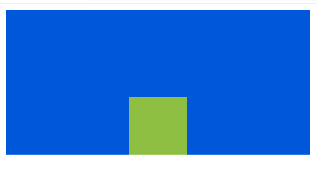
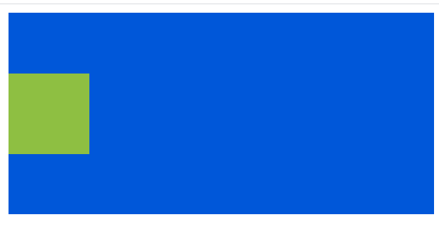

# 在 SASS 中如何将一个 div 放在另一个 div 的边上居中？

> 原文:[https://www . geeksforgeeks . org/如何将一个部门置于另一个部门的边缘/](https://www.geeksforgeeks.org/how-to-center-a-div-on-the-edge-of-another-div-in-sass/)

在本文中，我们将看到如何使用SASS **将一个 div 置于另一个 div 的边缘。SASS** 是 CSS 的扩展，代表**语法上很棒的样式表**。它帮助我们创建变量、嵌套规则等。这样我们就可以重用代码。

将一个 div 放在另一个 div 的边缘并不困难。我们可以通过使用位置属性和底部、顶部左侧和右侧属性来实现它。我们需要看到的是萨斯如何减少我们在这里的工作。

**示例:**
**HTML 代码:**在 HTML 中，我们将创建两个 div 元素。一个在外面的叫做**外格**，另一个叫做**内格。**

## 超文本标记语言

```html
<!DOCTYPE html>
<html>

<head>
    <title>
        How to centre a div on the 
        edge of another div
    </title>

    <link rel="stylesheet" 
        type="text/css" href="style.css" />
</head>

<body>
    <div id="outer-div">
        <div id="inner-div"></div>
    </div>
</body>

</html>
```

**SASS 代码:** Sass 用于给出一般的样式，并将内部 div 定心在外部 div 的边缘。我们用属性参数(高度、宽度、背景颜色和位置)创建一个名为 prop 的 mixin，这样我们就不需要为两个 div 元素写同样的东西。我们可以简单地包含这个 mixin 并提供属性值。我们使用 position 属性，将左边的属性值设置为 50%，这将使内部 div 水平居中。底部属性的值为零，因此内部 div 将位于外部 div 的边缘。

## 厚颜无耻

```html
// For properties of both div
@mixin prop ($height, $width, $bg, $pos) {
    height: $height;
    width: $width;
    background-color: $bg;
    position: $pos;
}

#outer-div {
    @include prop(190px, 50%, #0057D9, relative);
}

// Inner div properties
#inner-div {
    @include prop(70px, 70px, #8ebf42, absolute);
    left: 50%;
    transform: translate(-50%);
    bottom: 0;
    padding: 3px;
}
```

**输出:**



**将一个分区置于另一个分区(GFG)的边缘**

**示例 2:** 在本例中，将一个 div 置于另一个 div 的侧边中心。HTML 中的一切都将是一样的。在 Sass 中，我们使用值为 50%的 top 属性，它将使内部 div 垂直居中，并将 left 属性的值设置为零，这样内部 div 将位于侧边。除了这段代码，其余都是一样的。

## 厚颜无耻

```html
#inner-div {
    @include prop(70px, 70px, #8ebf42, absolute);
    left: 0;
    transform: translate(0, -50%);
    top: 50%;
    padding: 3px;
}
```

**输出:**



**另一个分区(GFG)左边缘的中心分区**

#### 例 3:

**HTML 代码:**在这个例子中，我们在外部 div 中创建了四个 div 元素。我们将看到如何将所有内部 div 元素集中在外部 div 的边缘。

## 超文本标记语言

```html
<!DOCTYPE html>
<html>

<head>
    <link rel="stylesheet" type="text/css" href="style.css" />
</head>

<body>
    <div id="outer-div">
        <div id="top-div"></div>
        <div id="left-div"></div>
        <div id="right-div"></div>
        <div id="bottom-div"></div>
    </div>
</body>

</html>
```

**Sass 代码:**在 Sass 中，我们创建了一个名为 prop 的 mixin，它包含在所有 div 元素中。同样，mixin 小 div 是为我们外部 div 中的所有 div 元素创建的。我们创建了另外两个 mixin 一个是 verticalcentre(mixin)，用于垂直居中 div。为了垂直居中 div，我们提供了 50%的最大值。在 verticalcentre(mixin)中，有一个 if and else 条件，如果 right 的值为 true，那么 right 属性的值将为零，否则 left 属性的值将为零，这将决定它在哪边。horizontalcentre(mixin)也有同样的逻辑，但它将水平居中。

## 厚颜无耻

```html
// Mixin for Common  properties of all div
@mixin prop($height, $width, $bg, $pos) {
    height: $height;
    width: $width;
    background-color: $bg;
    position: $pos;
}

// Div inside which we will centre another divs
#outer-div {
    @include prop(190px, 400px, #0057D9, relative);
}

// Common properties of all small divs
@mixin smalldiv {
    @include prop(50px, 50px, #8ebf42, absolute);
    padding: 3px;
}

// Mixin for div that vertically centred
// on the edge
@mixin verticalcentre($right:false) {
    top: 50%;
    transform: translate(0, -50%);
    @if ($right) {
        right: 0;
    }
    @else {
        left: 0;
    }
}

// Mixin for div that are horizontally
// centred on the edge
@mixin horizontalcentre($top:false) {
    left: 50%;
    transform: translate(-50%);
    @if($top) {
        top: 0;
    }
    @else {
        bottom: 0;
    }
}

// Including mixin in each div
#top-div {
    @include smalldiv;
    @include horizontalcentre($top: true);
}

#bottom-div {
    @include smalldiv;
    @include horizontalcentre($top: false);
}

#right-div {
    @include smalldiv;
    @include verticalcentre($right: true);
}

#left-div {
    @include smalldiv;
    @include verticalcentre($right: false);
}
```

**输出:**


**另一个分区(GFG)边缘的中心分区**