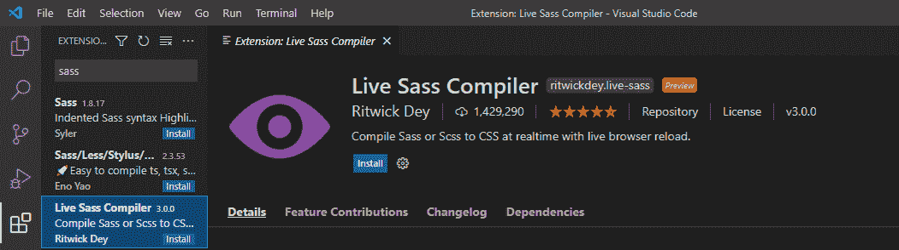

# 如何在项目中包含一个 SASS 库？

> 原文:[https://www . geesforgeks . org/如何在项目中包含一个 sass 库/](https://www.geeksforgeeks.org/how-to-include-a-sass-library-in-project/)

**本文的先决条件**包括一些关于 [SASS](https://www.geeksforgeeks.org/sass-introduction/) 及其在不同领域的应用的知识。

SASS 是一种脚本语言(类似 JS)，在浏览器中编译成 CSS。与普通的 CSS 样式相比，它提供了一些额外的好处，因此改进了编写 CSS 样式的方式。由于浏览器无法读取一个 sass 文件，所以我们需要使用一个 SASS 编译器，将它的文件转换成一个普通的 CSS 文件。

与 CSS 相比，SASS 提供的各种优势如下:

*   它提供了[混合](https://www.geeksforgeeks.org/how-to-create-optional-arguments-for-a-sass-mixin/)的使用，这被证明对于避免编写多次相同的代码是有用的。
*   它为我们提供了嵌套工具，并且允许我们任意使用变量。
*   它有庞大的支持社区。

因此，如今，在 CSS 面前，SASS 变得越来越重要。我们可以通过多种方式在项目中包含 SASS 库。其中一些解释如下:

**方法 1:通过 SASS 应用程序导入**

在这里，我们将使用手动程序在我们的电脑上安装 SASS，并在我们的项目中使用它。为此，请遵循下面给出的步骤。

*   在任何文件夹中下载 SASS 应用程序(zip)文件，并在那里提取它。(或任何其他您想要的文件夹。要下载 SASS，请访问其官方[网站](https://sass-lang.com/install)。


解压缩 zip 文件的目录。

*   提取后，将环境变量 PATH 添加到系统中的 SASS。


设置环境变量

*   因此，现在在我们的系统中安装了 SASS 库，现在可以工作了。您可以使用命令提示符检查这一点。

> 在命令提示符下键入“sass”检查它是否安装成功。


CMD 输出

**方法二:使用 npm 安装 SASS 库**

每当您使用一个名为 angular 或 react 的主要框架时，您可能会在系统中安装 npm。因此，SASS 也可以作为 npm 包使用，您可以使用它进行安装。

*   首先将当前目录更改为要安装 SASS 的目录或项目所在的目录，然后键入下面给出的命令。

**语法:**

```
npm install -g sass
```

*   这将安装 SASS，如下所示


npm 用于安装 sass

*   现在我们可以在我们的项目中导入它，并享受它的好处。

**方法 3:使用扩展和插件**

如果你正在使用 VS 代码编辑器或任何其他类似的类型，而不是为了使用 SASS，我们可以在我们的编辑器中安装插件或扩展。这将有助于我们在它们中有效地使用 SASS。 **Live sass 编译器**是 sass 的最佳 sass 扩展，可在 VS Code 获得，允许 sass 编译器实时工作。有了这个扩展，一旦网页重新加载，所有的 sass 代码都会被编译成 CSS。



VS 扩展

**方法四:使用 windows 包管理器或 Mac 包管理器。**

如果你是 windows 或 mac 用户，你可能不知道巧克力和 Herbrew。这些是软件包管理器，它使任何用户都可以轻松地下载、更新或卸载他们系统中的任何应用程序。此外，它还自动设置环境变量。因此，我们也可以使用这样的管理器来安装 sass。对于 windows，如果我们想这样做，我们必须编写下面给定的代码。

**语法:**

```
choco install sass
```

对于 mac，我们有下面给出的代码。

```
brew install sass/sass/sass
```

因此，通过这些方式，我们能够在我们的项目中安装并包含 SASS 库。