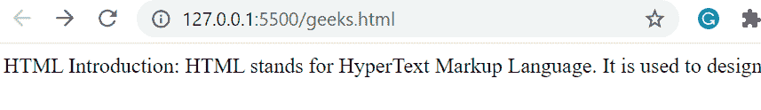

# 在 SASS 中如何防止文字多走一行？

> 原文:[https://www . geeksforgeeks . org/如何防止文字被一行多字占用/](https://www.geeksforgeeks.org/how-to-prevent-text-from-taking-more-than-one-line-in-sass/)

有时，我们希望通过防止文本占用多行或其他会停止换行的内容来显示网页中的文本。可以通过在 **sass** 文件中轻松添加一些属性来完成。

**方法:**我们开始创建一个简单的 HTML 文件，使用< p >标签在正文中添加一些文本。然后创建一个 sass 文件，并将其命名为“style”。该文件的扩展名为“”。SCS”。现在我们将添加代码，防止它占用超过 1 行。这里我们将使用 2 个名为空白和溢出的属性。空白的值将被隐藏，溢出的值将被隐藏。这样做之后，我们将保存该文件，并使用任何 sass 编译器将其转换为 CSS 文件。如果您正在使用 Visual Studio Code，您可以安装一个名为“Live Sass 编译器”的扩展，它将为您完成这项工作。最后，我们将把我们的 CSS 文件链接到前面创建的 HTML 文件的头标签中。

#### 使用的属性:

1.  **空白:**它有助于设置如何处理元素文本中的空白和换行符。
2.  **溢出:**它控制太大而无法适应其块格式上下文的内容会发生什么。

我们将设置属性值:

*   “ **nowrap** ”为空白属性，将空白折叠为一个，但抑制换行符。
*   “**隐藏”**为溢出属性，该属性剪辑溢出的内容，其余内容将变得不可见。

以下是 **style.scss** 文件的代码:

```css
div {
    white-space: nowrap;
    overflow: hidden; 
}
```

使用任何**萨斯编译器**将其编译并转换为 **css** 。将在名为 **style.css** 的同一文件夹中创建一个新文件。现在，将文件链接到 html。

## 超文本标记语言

```css
<!DOCTYPE html>
<html lang="en">

<head>

    <!--Linked the css file which was 
    compiled using the Sass compiler-->
    <link rel="stylesheet" href="style.css">
</head>

<body>
    <div>
        HTML Introduction: HTML stands for HyperText 
        Markup Language. It is used to design web 
        pages using a markup language. HTML is the 
        combination of Hypertext and Markup language. 
        Hypertext defines the link between the web 
        pages. A markup language is used to define 
        the text document within tag which defines 
        the structure of web pages.
    </div>
</body>

</html>
```

#### 输出:

