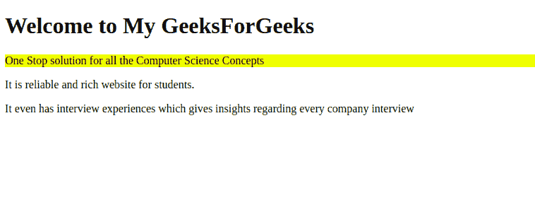

# 如何从带有 Sass 的元素中只选择直接子元素？

> 原文:[https://www . geesforgeks . org/how-select-only-direct-children-from-element-with-sass/](https://www.geeksforgeeks.org/how-to-select-only-direct-children-from-element-with-sass/)

**简介:**
Sass 是一种编译成层叠样式表(CSS)的脚本语言。它是一种预处理器语言。它最初由汉普顿·卡特林设计，然后由娜塔莉·韦森鲍姆开发。在最初的版本之后，威岑鲍姆和克里斯·爱普斯坦继续用 SassScript 扩展 SASS。它支持四种数据类型，它们是数字、字符串、颜色和布尔值。嵌套也适用于这种语言。

**关于问题的方法:**

*   首先在*中定义了内容。html 文件*。
*   在内容的 HTML 文件中，确保您正在放置子标签或在父标签中有子标签。
*   完成 HTML 标记后，在 SCSS 文件中使用“&”和“>”来设置直接子对象的样式。

**按代码实现:**

**app.component.html:**

```
<h1>Welcome to My GeeksForGeeks</h1>

<div>
  <p>One Stop solution for all the
    Computer Science Concepts </p>
</div>

<div>
  <span><p>It is reliable and rich
    website for students.</p></span>
</div>

<p>It even has interview experiences 
which gives insights regarding every 
company interview</p>
```

**app.component.scss:**

```
div {
    & > p {
       background-color: yellow;
    }
}
```

**app.module.ts:**

```
import { NgModule } from '@angular/core';
import { BrowserModule } from '@angular/platform-browser';
import { FormsModule } from '@angular/forms';

import { AppComponent } from './app.component';

@NgModule({
  imports:      [ BrowserModule, FormsModule ],
  declarations: [ AppComponent],
  bootstrap:    [ AppComponent ]
})
export class AppModule { }
```

**输出:**



如果你清楚地观察上面的截图，因为背景色只应用于直接的孩子。