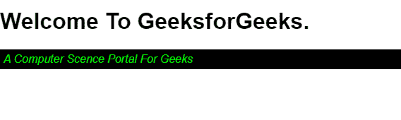
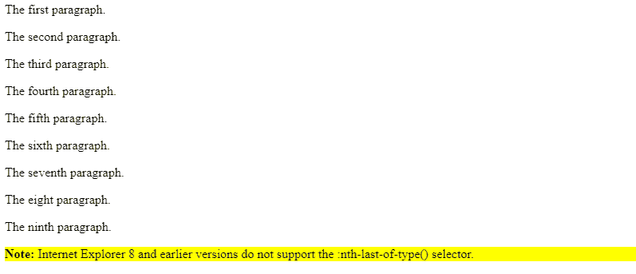

# SASS 中的最后一个子类型和最后一个类型选择器

> 原文:[https://www . geesforgeks . org/last-child-last-of-type-selector-in-sass/](https://www.geeksforgeeks.org/last-child-and-last-of-type-selector-in-sass/)

SASS 在语法上也被称为“棒极了的样式表”。它是一种被解释成 CSS 的编程语言。最后一个子元素选择器是一个选择器，允许用户定位包含元素内的最后一个元素。这个选择器也被称为结构伪类，这意味着它用于基于父内容和子内容来设计内容的样式。
最后一种选择器用于匹配容器中元素的最后一次出现。两个选择器的工作方式相同，但略有不同，即最后一个类型的指定少于最后一个子选择器。

**语法:**

*   对于最后一个子选择器:

    ```
    :last-child
    ```

*   对于最后一种类型:

    ```
    :last-of-type
    ```

**示例:**该示例实现了:最后一个子选择器。

```
<!DOCTYPE html>
<html lang="en">

<head>
    <title></title>
</head>

<body>
    <div>
        <h1>Welcome To GeeksForGeeks.</h1>
        <p>A Computer Science Portal For geeks!</p>
    </div>
</body>

</html>
```

**萨斯码:**

```
$myColor: lime
$bkc: black
$pad: 5px
p:last-child 
  color: $myColor
  background-color: $bkc
  padding: $pad
```

**输出:**编译完 SASS 源代码后，你会得到这个 CSS 代码。
T3】CSS 代码:

```
p:last child {
  color: lime;
  background-color: black;
  padding: 5px;
}
```



**示例:**最后一种样品示例如下所示

```
<!DOCTYPE html>
<html>

<head>
    <title>
        :last-of-type selector
    </title>
</head>

<body>
    <p>The first paragraph.</p>
    <p>The second paragraph.</p>
    <p>The third paragraph.</p>
    <p>The fourth paragraph.</p>
    <p>The fifth paragraph.</p>
    <p>The sixth paragraph.</p>
    <p>The seventh paragraph.</p>
    <p>The eight paragraph.</p>
    <p>The ninth paragraph.</p>

    <p>
        <b>Note:</b> Internet Explorer 8
        and earlier versions do not support
        the :nth-last-of-type() selector.
    </p>
</body>

</html>
```

**萨斯码:**

```
$bk: yellow
p:last-of-type 
  background-color: $bk
```

**输出:**
**CSS 代码:**

```
p:last-of-type {
  background-color: yellow;
}
```



**参考文献:**

*   [https://www.geeksforgeeks.org/css-last-child-selector/](https://www.geeksforgeeks.org/css-last-child-selector/)
*   [https://www.geeksforgeeks.org/css-last-of-type-selector/](https://www.geeksforgeeks.org/css-last-of-type-selector/)

**支持的浏览器:**SASS 中:最后一个子级和:最后一个类型选择器支持的浏览器如下:

*   谷歌 Chrome 4.0
*   Edge 9.0
*   Firefox 3.5
*   Safari 3.2
*   歌剧 9.6