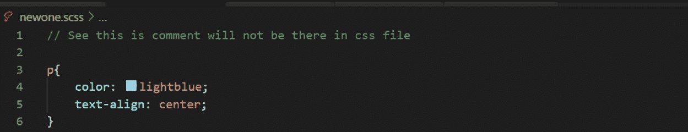
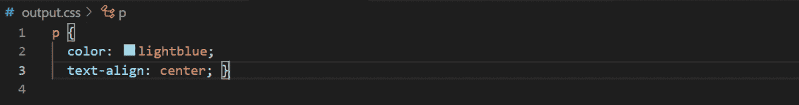
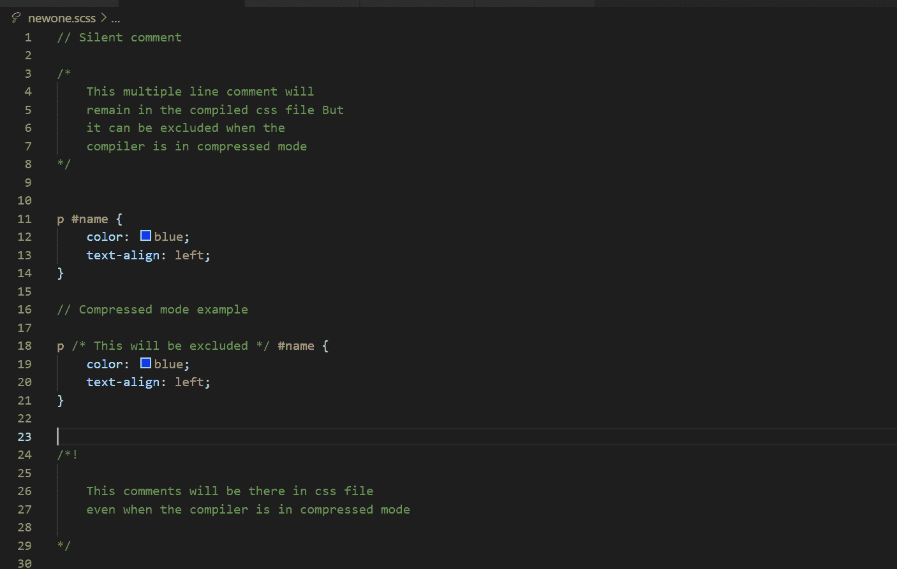
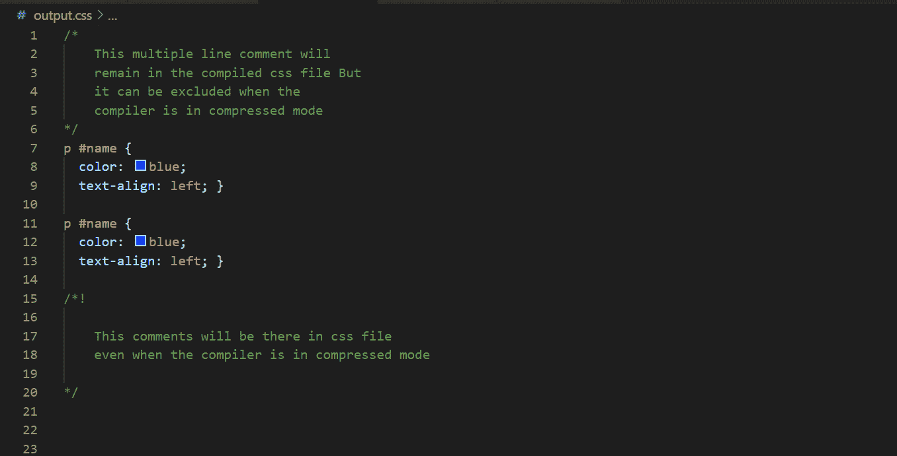

# SASS |评论

> 原文:[https://www.geeksforgeeks.org/sass-comments/](https://www.geeksforgeeks.org/sass-comments/)

**[【SASS】](https://www.geeksforgeeks.org/css-preprocessor-sass/)**中的注释与任何其他编程语言中的注释非常相似。但是，当我们谈论编译后的 CSS 文件中的注释类型时，就会有所不同。

**Sass 中有两类评论:**

1.  **Silent Comments:** Silent comments are single-line comments. When we compile Sass file these comments don’t reflect in compiled CSS file means these comments will not be there in CSS file.

    请看下面的例子来了解这个想法:

    *   **SCSS 文件:**
        
    *   **编译好的 CSS 文件:**
        
2.  **Loud Comments:** Loud comments are multiple line comments. These comments will be there in the compiled CSS file if the compiler is not in compressed mode.
    See the example below to get the idea:
    *   **SCSS 文件:**
        
    *   **编译好的 CSS 文件:**
        

    如果你想在压缩模式下也包含注释，那么就在注释的开头加上`/*!`标记，而不是`/*`。这些注释将一直存在于 CSS 文件中。