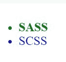

# SASS 完整形式

> 原文:[https://www.geeksforgeeks.org/sass-full-form/](https://www.geeksforgeeks.org/sass-full-form/)


SASS 代表**语法上非常棒的样式表**。它由汉普顿·卡特林设计，娜塔莉·韦森鲍姆开发。Sass 是一个 CSS 预处理器。Sass 减少了 CSS 的重复，因此节省了时间。它是一种样式表语言。它完全兼容所有版本的 CSS。

它是一种语言，可以让你以更方便、更高效的方式编写 CSS。写 SASS 有两种方法，一种是使用 Sass 语法，另一种是 SCSS 语法。它允许你写 DRY(不要重复自己)代码，这样代码会更快，更有效，更容易维护。

**什么时候用 SASS？**
当样式表更大、更复杂、更难维护时，可以使用 CSS 预处理器 SASS。SASS 允许您使用 CSS 中不存在的特性，如变量、嵌套规则、混合、导入、继承、内置函数和其他东西。

**SASS 的特点:**

*   Sass 与 CSS 完全兼容。
*   它比 CSS 强大。
*   它是 CSS 的超集。
*   它编译成可读的 CSS。
*   它支持变量、嵌套和混合。

**示例:** CSS

```html
//CSS
.header {
  width: 100%;
}
.header ul {
  padding: 30px;
}
.header ul li {
  font-size: 25px;
}
.header ul li.first {
  color: green;
  font-weight: bold;
}
.header ul li.sec {
  color: blue;
}
```

**示例:** SASS

```html
//SASS
//The above css can be written in sass without repetition
.header
{
width:100%;
  ul{
    padding:30px;
    li{
      font-size:25px;
      &.first{
        color:green;
        font-weight:bold;
      }
      &.sec{
        color:blue;
      }
    }
  }
}
```

```html
//html
<div class="header">
<ul>
<li class="first">SASS</li>
<li class="sec">SCSS</li>
</ul>
</div>
```

**输出:**


**SASS 的优点:**

*   比 CSS 少写。
*   允许您重用代码。

**SASS 的缺点:**

*   浏览器不懂 SASS，所以要转换成 CSS。
*   难以排除故障。