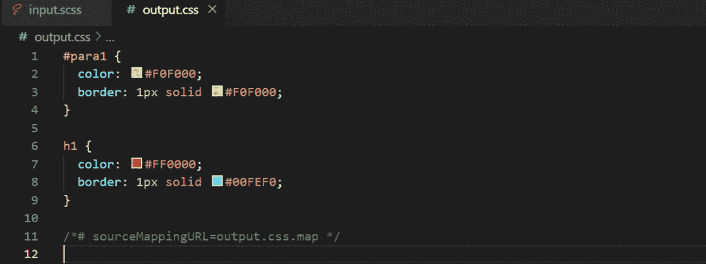

# SASS |变量

> 原文:[https://www.geeksforgeeks.org/sass-variables/](https://www.geeksforgeeks.org/sass-variables/)

本文包含了关于如何在 SASS 中定义变量以及变量作用域的信息。

先决条件:[CSS 中的变量](https://www.geeksforgeeks.org/css-variables/)

**一个变量的优势:**

1.  减少一次又一次的重复同样的事情。
2.  我们可以对+、-、/、*等变量进行数学运算，这让我们的工作变得更加容易。

1.  **在 SASS 中变量的声明:**在 SASS 中，可以通过在变量名称的开头使用$符号，然后是其值来定义变量。
    *   ****SCSS 文件:****

        ```html
        $textcolor: blue;
        $size: 10px;
        $border_changes: 1px solid rgba(255,153,153,0.2);

        #para1 {
            color: $textcolor;
            font-size: $size;
            border: $border_changes;
        }

        // You can also use other variables
        // in the declaration of a variable

        $border_changes2: 1px solid $textcolor;

        #para2 {
            color: $textcolor;
            font-size: $size;
            border: $border_changes2;
        }
        ```

    *   ****编译的 CSS 文件:****

        ```html
        #para1 {
          color: blue;
          font-size: 10px;
          border: 1px solid rgba(255, 153, 153, 0.2);
        }

        #para2 {
          color: blue;
          font-size: 10px;
          border: 1px solid blue;
        }
        ```

2.  **了解变量的范围:**在使用前，可以在文档中的任何地方声明 SASS 变量。
    *   ****SASS 文件:****

        ```html
        $global: #FF0000;

        #para1 {
            $local: #F0F000;
            color: $local;
            border: 1px solid $local;
        }

        // You can not use $local outside of its
        // #para1{ } block.
        // This will generate error 
        // saying "undefined variable"

        $global_onwards: #00FEF0; 

        h1 {
            // You can not use $local here
            color: $global;

            // You can use $global_onwards,
            border: 1px solid $global_onwards;
        }
        ```

    *   ****编译后的 CSS 文件:****
        
    1.  **全局变量:**在文件顶部声明的变量是全局的，即您可以在文档的任何地方使用它。
    2.  **作用域变量:**在任何块中声明的变量都是作用域的，即您不能在块的范围之外使用它。

关于变量有更多的概念，比如变量的阴影，变量的默认值，变量的流控制声明，这些将在下一篇文章中讨论。