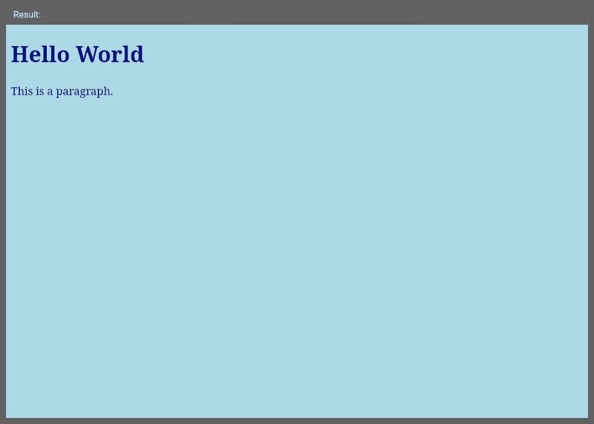
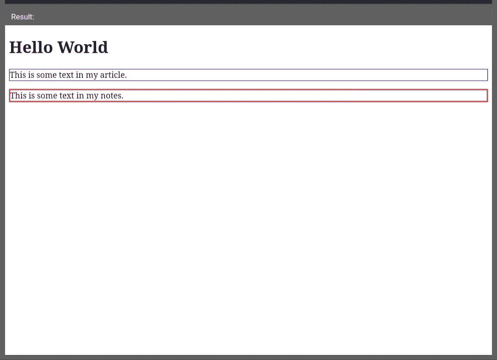

# 【Compass 和 SASS 有什么区别？

> 原文:[https://www . geeksforgeeks . org/指南针和 sass 的区别是什么/](https://www.geeksforgeeks.org/what-is-the-difference-between-compass-and-sass/)

**Compass:** Compass 是一个样式表分发框架。它是用 Ruby 编写的，主要是为了修复 CSS 中的缺点而开发的。Compass 附带了一个健壮的创作环境，这意味着我们开发的代码是自动监控的，并且稍后会以纯 CSS 形式编译使用。指南针利用了 SASS。

**指南针的特点:**

*   由 CSS 规则启用的 SASS 样式嵌套。
*   使用图像、颜色、字体和表达式的内置功能。
*   有助于创造美丽的印刷节奏。
*   有助于以更简单的方式下载和创建扩展。

**示例:**

```html
@import"compass/utilities/color/contrast";
@mixin bordered($color, $width) {
  border: $width solid $color;
}
.myBook {
  @include bordered(blue, 2px); 
}
.myStudy {
  @include bordered(red, 3px);
}

```

**输出:**


**SASS:** SASS 代表语法上非常棒的样式表。它只是 CSS 的一个扩展，使我们能够利用变量、内联导入、嵌套循环等等。SASS 通常被解释为级联样式表。SASS 使用两种语法:

*   预期的语法
*   莎茜 css

**SASS 的特点:**

*   SASS 允许在内部定义变量。
*   SASS 支持插值，即您可以在变量中定义一个元素，然后在 SASS 代码中进行插值。
*   SASS 有几个内置的功能。当前功能与颜色、字体和表达式相关。
*   SASS 与 CSS 的所有版本兼容。

**示例:**

```html
$bgcolor: blue;
$primary-color: #212; 
body { 
  background-color: $bgcolor
  color: $primary-color; 
}

```

**输出:**


尽管 Compass 和 SASS 听起来很相似。两者有显著差异。这些是:

| S.No | 指南针 | 厚颜无耻 |
| 定义 | Compass 是一个存储原始代码和附加内置函数的 SASS 库。 | SASS 只是 CSS3 的扩展，它包括变量、循环、选择器继承等等。 |
| 需要 | CSS 中没有供应商前缀。 | 变量的存在被认为是关键因素。 |
| 简单 | 指南针混合使 CSS3 非常容易，没有太多的复杂性。 | SASS 提供了一个格式良好的 CSS。这样更容易组织和维护。 |
| 同意 | 相对而言，Compass 在公司中的支持率低于 SASS。 | SASS 有更多的批准，大约有 2098 个公司堆栈。 |
| 使用 | 像*weely*和*moviela*这样的公司使用指南针。 | *潘多拉**广场*和 *Airbnb* 使用 SASS。 |