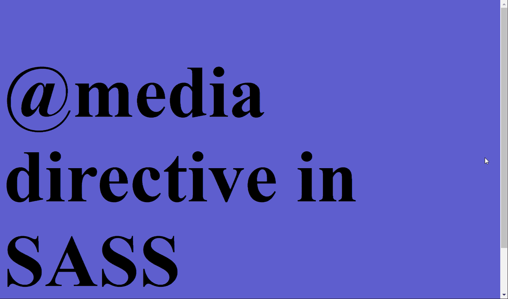

# 在 SASS 中@media 指令的作用是什么？

> 原文:[https://www . geesforgeks . org/什么是媒体角色指令 in-sass/](https://www.geeksforgeeks.org/what-is-the-role-of-media-directive-in-sass/)

**SASS** 代表语法上很棒的样式表。它基本上是一个 CSS 预处理器，帮助我们减少 CSS 代码中的重复，也有助于降低 CSS 代码的复杂性。使用不同的特性，如混合、变量等，SASS 使代码易于理解。SASS 的一个重要特性就是 **@media** 指令，它在正常的 CSS 中做媒体查询的工作。在本文中，我们将学习如何在 SASS 中使用@media 指令，并且它是有效的。

为了创建一个响应迅速的网站，我们为不同的屏幕宽度和高度定义了不同的 CSS 样式。这可以使用 CSS 中的媒体查询来完成，但是，代码变得非常大，我们必须多次重复代码。SASS 使用 **@media** 指令降低了这种复杂性。该指令允许元素适应不同的屏幕宽度。

**语法:**

```css
.element {
    @media screen and (...) {

    }
}
```

从上面的语法可以看出，与 CSS 不同的是@media 指令可以在选择器中定义，这使得代码更短，更容易理解。

**示例:**在下面的示例中，我们使用 SASS @media 指令根据屏幕宽度的变化更改了背景颜色和字体大小。我们将使用使用 sass 命令生成的“style.css”链接该文件。

## 超文本标记语言

```css
<!DOCTYPE html>
<html lang="en">

<head>
    <link rel="stylesheet" 
          href="style.css">
</head>

<body>
    <h1>@media directive in SASS</h1>
</body>

</html>
```

## 厚颜无耻

```css
body {
    background-color: rgb(95, 95, 207);
    font-size: 5rem;

    @media screen and (max-width : 800px) {
        background-color: rgb(150, 150, 235);
        font-size: 4rem;
    }

    @media screen and (max-width: 500px) {
        background-color: rgb(58, 58, 247);
        font-size: 3rem;
    }
}
```

**输出:**

