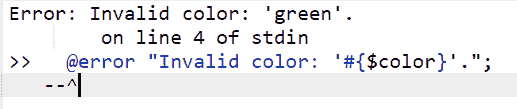
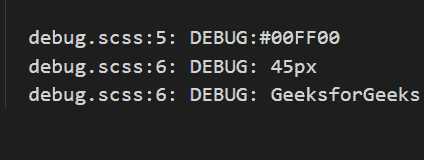

# SASS 中@error 和@debug 指令的用法是什么？

> 原文:[https://www . geesforgeks . org/什么是使用错误和调试指令-in-sass/](https://www.geeksforgeeks.org/what-is-the-use-error-and-debug-directives-in-sass/)

在本文中，我们将看到在 SASS 中使用 **@error** 和 **@debug** 指令。Sass 是 CSS 的一个扩展，代表语法上令人敬畏的样式表。它帮助我们创建变量、嵌套规则等。这样我们就可以在多个元素中重用代码。

**@错误指令**

Sass 由三个用于向开发人员提供反馈的指令组成。其中之一就是 **@error** 指令。当您想要显示错误时使用它。它会完全停止 Sass 编译器，并将 SassScript 表达式值显示为致命错误。我们可以使用这个指令向开发人员发送一个消息，这样他们就可以立即停止并纠正他们的错误。它帮助开发人员知道他们在代码中的错误，因为 Sass 还提供了错误发生的行号以及@error 输出。

**示例:**下面给出的是以扩展名保存的名为 Error.scss 的样式表文件。scss，类似于 css 文件。

```css
$color:  green;
  @error "Invalid color: '#{$color}'.";  
```

以下命令将开始监视 SASS 文件中的更改，并自动生成相应的 CSS 文件。

```css
sass --watch Error.scss:Error.css
```

**输出:**



**@调试指令**

**@debug** 指令显示了 SassScript 表达式值。它打印表达式的值、文件名和行号。当开发人员在开发样式表时想要查看变量或表达式的值时，可以使用该指令。因此@debug 打印它包含的任何 Sass 表达式的值(变量、数学等)。)到开发人员的控制台。非常适合个人调试工作。

**示例:**下面给出的是以扩展名保存的名为 debug.scss 的样式表文件。scss，类似于 css 文件。

```css
$color-green: #00FF00;
$font-sizes: 25px + 20px;;

.container {
  @debug $color-green;
  @debug $font-sizes;
  @debug "GeeksforGeeks";
}
```

以下命令将开始监视 SASS 文件中的更改，并自动生成相应的 CSS 文件。

```css
sass --watch debug.scss:debug.css
```

**输出:**

