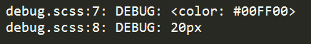
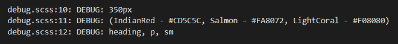

# 哪个指令用于检测 SASS 中的错误？

> 原文:[https://www . geeksforgeeks . org/哪个指令用于检测 sass 中的错误/](https://www.geeksforgeeks.org/which-directive-is-used-to-detect-the-errors-in-sass/)

为了检测 [SASS](https://www.geeksforgeeks.org/sass-introduction/) 中的错误，应该使用**@调试指令**。它显示了 SassScript 表达式值。当任何人在开发文件时想要查看变量或表达式的值时，都可以使用它。

让我们看一个例子，这样我们就能以实用的方式了解更多关于 **@debug** 指令的信息。只需按照以下步骤了解实现:

*   首先创建一个 SASS 文件，对于这个例子，我把它命名为 *debug.scss* 。
*   现在用它们的值定义一些变量。

    ## 半铸钢ˌ钢性铸铁(铸造半钢)

    ```html
    $style: (
        color: #00FF00
    );
    $font-sizes: 15px+5px;

    .container {
      @debug $style;
      @debug $font-sizes;
     }
    ```

*   以下命令将开始监视 SASS 文件中的更改，并自动生成相应的 CSS 文件。

    ```html
    sass --watch debug.scss:debug.css
    ```

*   Output will show the code which you have debugged using the @debug directive:

    

**例:**我们再来看一个例子，了解清楚。遵循与上面相同的步骤。

## 半铸钢ˌ钢性铸铁(Cast Semi-Steel)

```html
$width: 350px;
$colors: (
    IndianRed: #CD5C5C,
    Salmon: #FA8072,
    LightCoral: #F08080
);
$font-sizes: heading, p, sm;

.container{
  @debug $width; /* single value */
  @debug $colors; /* map */
  @debug $font-sizes; /* list */
}
```

**输出:**

